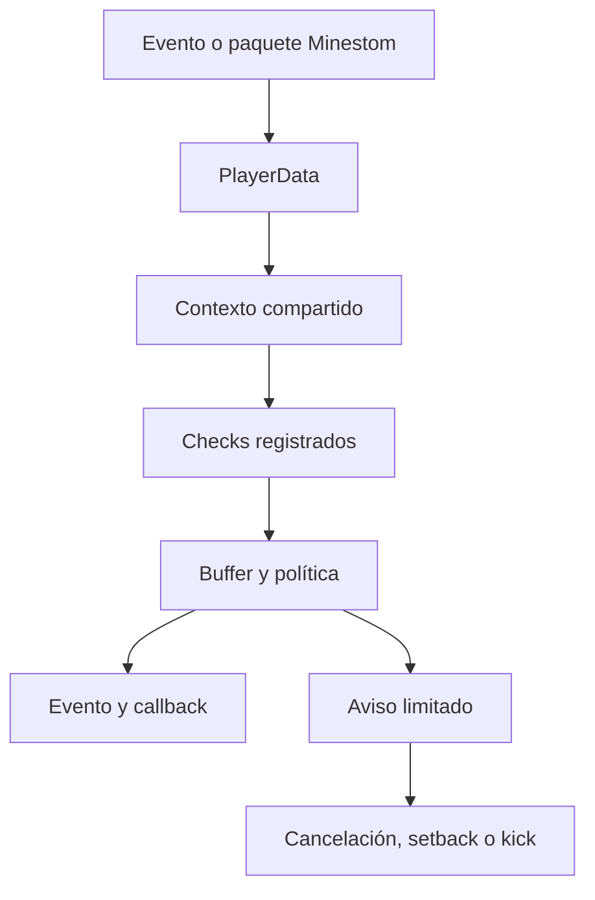

# Arquitectura

## Objetivos

CatAC separa captura, estado, detección y aplicación. La intención es que un
check decida si una muestra es anómala, pero no manipule directamente al jugador.
Esto permite ejecutar los mismos checks en monitorización, setback o kick.

## Flujo de una muestra

1. `CatEngine` recibe eventos desde un único `EventNode`.
2. `PlayerDataManager` obtiene el estado del jugador por UUID.
3. En movimiento, `CollisionAnalyzer` calcula una sola instantánea reutilizable.
4. Cada check devuelve un `CheckResult`, sin aplicar sanciones por su cuenta.
5. `EnforcementEngine` actualiza el buffer y resuelve la acción según política y modo.
6. La infracción se publica como `CatViolationEvent` y mediante el callback.

## Estado por jugador

`PlayerData` conserva únicamente datos acotados:

- una entrada de `ViolationState` por check;
- un `MovementFrame` mutable que se reutiliza;
- historial circular de posiciones para rewind;
- estado de excavación;
- sincronización de RTT/jitter, teletransporte y velocidades con arreglos fijos;
- contadores de aire, deltas anteriores y balance de paquetes;
- última posición segura y ventanas de exención.

No se crean listas de bloques ni objetos de contexto por check. La instantánea de
colisión se limpia y rellena para la siguiente muestra.

## Colisiones

`CollisionAnalyzer` examina la AABB del jugador y las formas de colisión reales
de Minestom. Produce señales compartidas: soporte bajo los pies, intersección con
sólido, chunk incompleto, líquido, escalable, telaraña, honey/slime, fricción y
factor de velocidad de superficie.

Si falta un chunk o aparece una mecánica física que el predictor inicial no puede
modelar con seguridad, los checks de movimiento se abstienen. Un falso negativo
acotado es preferible a castigar una transición legítima.

## Buffers y aplicación

Un fallo suma su `severity`; un pase resta `decayPerPass`. Los tres umbrales de la
política son crecientes:

- `alertBuffer`: publica telemetría respetando el cooldown;
- `setbackBuffer`: habilita el retorno a `lastSafePosition`;
- `kickBuffer`: permite expulsión cuando el modo global es `KICK` y se han
  emitido los avisos requeridos para ese mismo check.

Los resultados `cancel` detienen inmediatamente paquetes cuya ejecución no es
segura (por ejemplo inventario estructuralmente imposible o fast-break
confirmado), aunque la sanción mayor siga dependiendo del buffer. Las señales
físicas ambiguas acumulan evidencia antes de bloquear. `disconnect` se reserva
para datos no finitos o equivalentes y puede deshabilitarse con
`disconnectMalformedPackets(false)`.

`ViolationState` mantiene dos cooldowns independientes: el de alertas para
moderación y el de avisos al jugador. Los avisos se cuentan por check, nunca de
forma global, por lo que una anomalía de inventario no puede desbloquear un kick
de movimiento. `PlayerMessageProvider` produce los textos en el hilo de evento
y puede devolver `null` para suprimir selectivamente una notificación.

## Lag y latencia

`TickHealth` observa la duración de ticks. Si supera el umbral configurado abre
una ventana breve de compensación para timer y fast-break. La latencia del jugador
añade tolerancia acotada, nunca una exención ilimitada. Reach consulta posiciones
históricas dentro de una ventana máxima de 750 ms.

`PlayerSynchronization` añade una capa independiente de los checks: envía una
sonda `PingPacket` periódica y mide su `ClientPongPacket`, conserva RTT y jitter
suavizados y limita a ocho sondas en vuelo. Cada velocidad se asocia al primer
Ping emitido al final del tick, de modo que su Pong confirma que el cliente vio
los paquetes anteriores en la conexión ordenada. Los teletransportes capturan
el ID enviado por Minestom y sólo se cierran con el `ClientTeleportConfirmPacket`
correspondiente. Mientras exista sincronización pendiente, los checks predictivos
de movimiento se abstienen; todos los estados vencen tras el timeout configurado.

## Predictor y barrido de movimiento

`MovementPrediction` conserva sólo las velocidades horizontal y vertical de la
muestra anterior y calcula una envolvente superior para la siguiente. En suelo
usa la aceleración de vanilla, fricción de superficie y atributo de movimiento;
en aire aplica drag y aceleración aérea. En vertical aplica gravedad y drag o
permite la velocidad de salto, incluyendo `JUMP_BOOST`. Es una envolvente, no un
replay de entradas del cliente: CatAC no inventa teclas que el protocolo no
envía y prefiere abstenerse ante mecánicas que no puede modelar.

El `CollisionAnalyzer` primero inspecciona la AABB destino y luego barre las
AABB intermedias cada 0,20 bloques, hasta 32 pasos. Esto conserva un coste
máximo por paquete y detecta un cruce de pared aunque la caja final ya no esté
dentro del bloque. Si una AABB intermedia toca un chunk ausente, marca la
instantánea incompleta para impedir una detección basada en mundo parcial.

## Combate temporal

`EntityHistoryManager` mantiene una `PositionHistory` circular de 32 muestras
por entidad viva. La entrada se actualiza en `EntityTickEvent` y se elimina en
`EntityDespawnEvent`, con comprobación de identidad además del ID para que un
ID reutilizado no herede datos de una entidad anterior.

Al recibir un ataque, `combat.reach` determina un instante pasado con la mitad
del RTT observado, jitter y un padding pequeño. Recupera mediante interpolación
la posición del objetivo en ese instante. Después mide ojo-AABB y recorre la
línea hasta la AABB contra las formas de colisión. Una dirección de cámara
posiblemente desfasada no se convierte por sí sola en detección. La compensación
cambia *cuándo* se evalúa el objetivo, no la distancia máxima permitida por el
atributo de interacción.

## Mundo, inventario y observabilidad

Las interacciones de bloques se validan antes del listener nativo: CatAC comprueba
el alcance ojo-AABB del bloque y los cursores de placement. Las acciones de
inventario validan referencias estructurales (ventana, slot y hotbar), pero
delegan la semántica completa del click al `ClickPreprocessor` de Minestom para
no divergir de vanilla o de GUIs de plugins.

`EnforcementMetrics` usa contadores lock-free, separados del estado por jugador.
`CatAC.metrics()` produce una instantánea de muestras anómalas, alertas y
acciones aplicadas. Las métricas pueden apagarse en configuración y no almacenan
evidencia, inventarios ni tráfico.

## Sonda privada de aura

Ante un fallo de alcance con severidad configurable, `AuraDecoyManager` reserva
un ID de entidad y emite un perfil no listado más `SpawnEntityPacket` sólo por
la conexión del sospechoso. El estado por jugador conserva ese ID, UUID, posición
horizontal, armado, expiración y cooldown; no existe entidad en la instancia.
La destrucción se envía en expiración, desconexión o apagado.

Un `ClientInteractEntityPacket.Attack` sólo confirma si apunta a ese ID tras el
armado y el vector de vista sigue orientado en sentido contrario. Esta sonda no
se ejecuta ante exenciones manuales, velocidad/teletransporte pendiente,
vehículos o elytra. La señal respeta el `EnforcementMode` global.

## Barrera de daño

Cuando un `PacketCheck` cancela un `ClientInteractEntityPacket.Attack`,
`CatEngine` arma un `DamageGuardState` acotado en el atacante con UUID de la
víctima, razón y expiración. En `EntityDamageEvent`, sólo el atacante y la
víctima exactos pueden consumir esa guarda. `DamageDecisionProvider` devuelve
`DENY` o `ALLOW`; el valor predeterminado cancela el evento antes de que Minestom
modifique la vida. Un error del proveedor lo desactiva y conserva la decisión
segura de denegar para una acción ya invalidada.

La API pública `CatAC.denyDamage` permite a checks externos usar la misma
barrera sin tocar salud, knockback ni estados de la víctima. No hay listas de
ataques ni retención de entidades: cada jugador conserva una sola guarda.

## Presupuesto de paquetes

`PacketFloodState` reside dentro de `PlayerData` y contiene dos token buckets,
un instante de refill y una única ventana de strikes. El coste es constante y
no usa contenedores ni tareas. `PacketFloodPolicy` consume primero el presupuesto
global y luego el presupuesto de paquetes `HEAVY`; si uno se agota, el
`PlayerPacketEvent` se cancela antes de que `PacketListenerManager` invoque el
listener vanilla.

El clasificador público usa `NORMAL` para paquetes desconocidos/custom y marca
como `HEAVY` sólo familias que pueden provocar trabajo desproporcionado. El
callback y el evento se aíslan mediante circuit breaker: si un handler externo
falla, CatAC lo desactiva y sigue descartando el flood. Esta capa actúa después
de la decodificación de Minestom y antes de la lógica de juego; los límites de
bytes, compresión y conexiones pertenecen al proxy/firewall del servidor.

## Validación offline

El paquete `dev.catac.testing` no participa en la inicialización de CatAC ni en
el camino caliente. Sus APIs reciben datos genéricos del adaptador del servidor:
`ReplayRunner` aplica tiempo controlado, `PacketFuzzer` genera entradas límite,
`HotPathBenchmark` mide distribuciones locales y `CalibrationAnalyzer` agrega
señales exportadas desde monitorización. Esta separación evita que un sistema de
captura o análisis altere las decisiones de detección en producción.

## Extensiones

Un check implementa exactamente una de estas interfaces:

- `PacketCheck`: inspección temprana de paquetes y posibilidad de cancelación.
- `MovementCheck`: recibe `MovementFrame`, colisiones y estado ya calculados.

Los IDs deben ser únicos y seguir el patrón `segmento.segmento`. El registro se
congela al construir `CatAC`; así el bucle caliente itera arrays estables.

## Modelo de concurrencia

El estado está diseñado alrededor del modelo de eventos por jugador de Minestom.
No debe mutarse `PlayerData` desde tareas arbitrarias. Los callbacks de infracción
deben ser cortos; para I/O, copian los datos necesarios y delegan fuera del hilo de
evento. La configuración es inmutable después de construirse.
