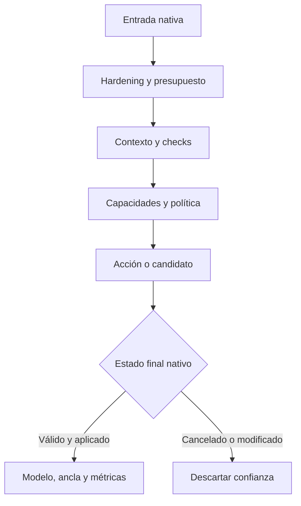

# Arquitectura de CatAC 2.0

## Flujo y autoridad

`CatEngine` recibe paquetes y eventos mediante un EventNode de Minestom. Los checks devuelven evidencia; `EnforcementEngine` combina capacidades, perfil y política. La aplicación nativa y el resultado final del host se confirman antes de aprender movimiento o contabilizar acciones. Un callback de infracción informa una decisión; no demuestra que se haya ejecutado.

```mermaid
flowchart TD
    A["Entrada nativa"] --> B["Hardening y presupuesto"]
    B --> C["Contexto y checks"]
    C --> D["Capacidades y política"]
    D --> E["Acción o candidato"]
    E --> F{"Estado final nativo"}
    F -->|"Válido y aplicado"| G["Modelo, ancla y métricas"]
    F -->|"Cancelado o modificado"| H["Descartar confianza"]
```

La entrada del cliente nunca define una exención, un perfil, un ancla o el impulso esperado. Suelo, colisión horizontal y bits de entrada son afirmaciones no confiables. El perfil y las mecánicas admitidas proceden del host; posición aplicada, atributo, herramienta, bloque y velocidad enviada proceden del servidor.

## Resultados, capacidades y degradación

`CheckResult` distingue no aplicable, incertidumbre, pase, infracción y formato inválido. La incertidumbre puede solicitar reconciliación sin severidad. Sólo un fallo positivo suma evidencia; el decaimiento utiliza el reloj inyectado y tiempo transcurrido. Las ventanas toleran origen monotónico negativo y rollover, con duración máxima de 24 horas.

`CheckDescriptor` se captura una vez en el registro congelado. Las clases de paquetes se cachean para dispatch. `cancelAction`, `correctMovement`, `kick` y `hardening` son independientes, con validación de combinaciones incompatibles. `OBSERVE` es un techo permanente; cambiar el modo no amplía capacidades. Los perfiles distintos de Java 1.21.11 limitan los fallos de gameplay a monitorización. Un `uncertainCancel` de ventana/objetivo obsoleto sigue siendo reconciliación, independiente de ese modo.

Una excepción desactiva el check para esa instancia, aumenta `faults` y no genera un pase. No hay reintento automático ni reparación silenciosa. La salud de proveedores, los overflows y fallos de callbacks quedan expuestos; los logs se limitan por categoría. Si falla un validador necesario, no se alimenta la física dependiente. Hardening no consulta las exenciones del host.

## Propiedad del estado y límites

El estado mutable por jugador se serializa con `synchronized(data)` en las rutas del motor y API. Los historiales proporcionan snapshots bajo su propio monitor; un atacante no necesita adquirir el monitor del objetivo. La retirada de una sesión y el cierre del manager impiden recrearla durante shutdown. Esto protege las rutas de CatAC; no permite que extensiones manipulen `PlayerData` desde workers arbitrarios.

| Estado | Cota |
|---|---|
| Buffer y runtime | Una entrada por check registrado; registro congelado |
| Historial | 64 muestras por jugador/entidad viva rastreada |
| Sondas Ping | 8 pendientes por jugador |
| Velocidades asociadas a sondas | 8 pendientes por jugador |
| Mailbox de señales de salida | 16 entradas por jugador; overflow visible |
| Trace de detecciones | 0 por defecto; máximo 256 entradas por jugador |
| Broad phase de colisión | 512 celdas por análisis; exceso produce incompleto |
| Evidencia textual / modelo | 512 / 96 caracteres |
| Lectura de replay | 100.000 entradas; 1.024 caracteres por línea |

La memoria total sigue creciendo con jugadores, entidades vivas y checks registrados; las cotas por entrada no son una cota global del servidor. Un overflow de salida reinicia el modelo y abre una gracia; no se oculta como sincronización correcta.

## Movimiento y confianza

Se observa un destino antes de su aplicación. Sólo un candidato limpio, aprobado por los validadores obligatorios y coincidente con posición/instancia nativas finales confirma el predictor. Un candidato sospechoso en `MONITOR` puede seguir en el historial de observaciones, pero no enseña velocidad ni actualiza el ancla. Los eventos sólo de rotación no añaden un paso de física de XYZ.

El ancla incluye instancia, se actualiza después de suelo estable y se revalida contra el mundo actual antes de corregir. Un teleport del host no autoriza su candidato pre-commit: se confirma su posición nativa y su geometría. Si el host cancela o modifica un destino, el candidato original se descarta. Los receipts de cancelación/corrección se resuelven en la siguiente entrada o EntityTick del jugador; el contador de setback exige un cambio nativo compatible, no sólo intención de cancelación.

`MovementPrediction` guarda vx/vy/vz y usa fricción, aceleración, gravedad, drag, atributos y efectos soportados. La observación actual no siembra la predicción usada para evaluar ese mismo frame. Los impulsos usan el vector enviado por el servidor; las unidades se distinguen: velocidad de entidad en bloques/segundo y EntityVelocityPacket en bloques/tick. Es una envolvente conservadora, no una reproducción bit a bit de todas las entradas del cliente.

La calidad física se limita en líquidos, escalada, uso de objetos y otras mecánicas que el núcleo no modela completamente. Los nuevos checks experimentales aportan observación; elytra, riptide, vehículos y vuelo personalizado no reciben una simulación completa en esta versión. Phase conserva su validación geométrica cuando el medio suspende la física, salvo las exenciones geométricas explícitas.

## Colisión continua

`CollisionAnalyzer` utiliza `Shape.intersectBoxSwept` de la dependencia fijada, con búsqueda de shapes vecinas, destino, soporte y contactos. Prueba orden vertical, alternativas horizontales y step arriba-horizontal-abajo según el atributo. El presupuesto cuenta celdas; al excederlo no se degrada a un muestreo de menor resolución ni acepta un ancla.

Se conserva el factor lento 0,4 de superficies correspondientes y se toman contactos reales para fricción. El barrido nativo aplica una piel numérica (`0.99999`); CatAC tolera `2e-5` en la fracción de recorrido y contrae mínimamente la caja para distinguir contacto final de penetración. Las regresiones cubren aterrizaje, paneles finos, fences, slabs, stairs y deslizamiento por esquina. Un inicio dentro de un sólido produce incertidumbre en vez de un phase fabricado.

## Sincronización y rewind

PlayerPacketOutEvent puede llegar desde otro hilo: encola señales acotadas que el estado del jugador drena. `PlayerSynchronization` avanza por EntityTick del jugador; ServerTickMonitor actualiza sólo salud de ticks. La ID del teleport observado debe coincidir con el envío pendiente; un confirm antiguo no desbloquea uno nuevo. La expectativa nativa de Minestom permanece incierta aunque expire el tracker de CatAC.

Las sondas y vectores usan IDs exactas, capacidad fija y expiración. Un Pong desconocido, duplicado o tardío no aplica una velocidad pendiente. Incluso un Pong correcto demuestra orden/recepción, no respuesta física. `SynchronizationDiagnostics` expone timeouts, sobrescrituras e ignorados.

El historial almacena Pos, AABB, instancia, generación y tiempo. Cambios de instancia, saltos mayores de 8 bloques y huecos mayores de 250 ms abren discontinuidades; una AABB/pose distinta no se interpola. La calidad diferencia EXACT, INTERPOLATED, MISSING, OUT_OF_RANGE, DISCONTINUITY y GAP. No se usa un extremo viejo como sustituto de un tiempo fuera de rango. El rewind de combate predeterminado se limita a 350 ms y tiene un máximo configurable de 500 ms; nunca aumenta el atributo de reach.

## Acciones nativas

El combate separa objetivo, distancia mínima ojo-AABB, oclusión y rayo de cámara. El rayo es observacional porque el orden de paquetes y la vista histórica introducen ambigüedad. Reach no depende de orientar la cámara hacia el objetivo para detectar una pared. Un objetivo/historial obsoleto provoca abstención o reconciliación, no evidencia punitiva inventada.

Fast-break conserva herramienta completa, bloque, instancia y tiempo esperado nativo; si cambia el contexto, se abstiene/reconcilia. El tiempo de tolerancia por red está acotado. Las interacciones de bloques usan el atributo del servidor y reconcilian target, vecino y secuencia tras una cancelación.

Los clicks válidos siguen el preprocesador y los listeners nativos. CatAC no vuelve a aplicar el click ni inventa una segunda transacción de stateId; en la versión fijada, el comportamiento nativo de inventario no proporciona ese protocolo como autoridad independiente. Ventanas obsoletas se cancelan y actualizan sin infracción.

La guarda de daño es una operación explícita del host. El overload con actionId positivo sólo se consume para ese atacante, víctima y acción, una vez. El overload legado síncrono usa otra ruta y se limpia al iniciar el siguiente ataque nativo. No se arma una guarda para un ataque que ya se impidió ejecutar.

## Telemetría y coste

`diagnostics()` distingue evaluaciones, pases, fallos, skip, incertidumbre, bypass y fallos de runtime; incluye motivos y coste acumulado/máximo. `metrics()` cuenta acciones confirmadas. El ring opcional almacena evidencia numérica y decisión sin posiciones o payloads de paquetes; no captura un replay automáticamente.

El reloj inyectado gobierna lógica y replay. El coste real se mide con `System.nanoTime()` para no confundir timestamps sintéticos con rendimiento. El benchmark incluido ejecuta listeners nativos con transporte en memoria y un solo jugador; su alcance y resultados están en VALIDACION.md. No se extrapola a concurrencia, red real o capacidad de producción.
