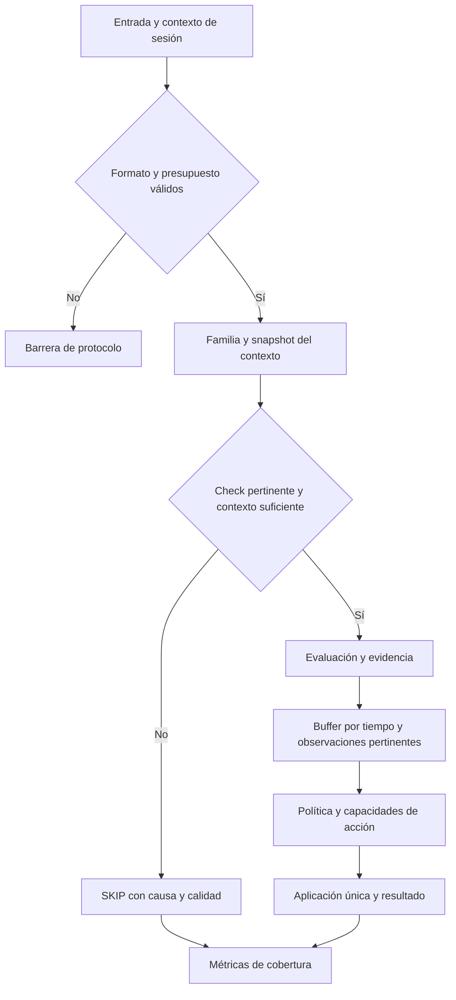

# CatAC Core: evaluación técnica y plan completo de mejora del antitrampas

**Fecha:** 3 de octubre de 2026.  
**Estado:** documento de preparación; ninguna mejora de código ha sido implementada.  
**Base examinada:** `CatAC-core-main.zip`, proyecto Maven `dev.catac:catac-core:1.0.0`.  
**Objetivo declarado del proyecto:** Java 25 y Minestom `2026.05.11-1.21.11`, para Minecraft 1.21.11.  
**SHA-256 del ZIP:** `e28177b2c2c8f613b534b567bc533144647560ef9305a8516d144792f70a4343`.

Este documento sirve como guía para desarrollar las próximas mejoras de CatAC. Las rutas y líneas citadas corresponden exclusivamente al ZIP evaluado, sin su directorio exterior `CatAC-core-main/`. Los nombres de componentes nuevos, contratos y parámetros descritos como **propuestos** todavía no existen en el proyecto. Las rutas Java abreviadas (`engine/...`, `state/...`, etc.) parten de `src/main/java/dev/catac/`.

## Índice

1. [Dictamen y alcance de la evaluación](#1-dictamen-y-alcance-de-la-evaluación)
2. [Inventario técnico y capacidades actuales](#2-inventario-técnico-y-capacidades-actuales)
3. [Prioridades y registro de hallazgos](#3-prioridades-y-registro-de-hallazgos)
4. [Análisis detallado de los problemas](#4-análisis-detallado-de-los-problemas)
5. [Arquitectura objetivo y contratos](#5-arquitectura-objetivo-y-contratos)
6. [Plan de mejora de movimiento y colisiones](#6-plan-de-mejora-de-movimiento-y-colisiones)
7. [Plan de mejora de combate](#7-plan-de-mejora-de-combate)
8. [Plan de mejora de mundo e inventarios](#8-plan-de-mejora-de-mundo-e-inventarios)
9. [Paquetes, sincronización y disponibilidad](#9-paquetes-sincronización-y-disponibilidad)
10. [Integraciones y mecánicas personalizadas](#10-integraciones-y-mecánicas-personalizadas)
11. [Telemetría, rendimiento y conservación de evidencia](#11-telemetría-rendimiento-y-conservación-de-evidencia)
12. [Pruebas, replay y calibración](#12-pruebas-replay-y-calibración)
13. [Backlog por fases y criterios de aceptación](#13-backlog-por-fases-y-criterios-de-aceptación)
14. [Despliegue, compatibilidad y reversión](#14-despliegue-compatibilidad-y-reversión)
15. [Límites del antitrampas y decisiones pendientes](#15-límites-del-antitrampas-y-decisiones-pendientes)
16. [Fuentes y checklist de preparación](#16-fuentes-y-checklist-de-preparación)

## 1. Dictamen y alcance de la evaluación

### 1.1 Dictamen

**CatAC tiene una base útil para evolucionar, pero el código disponible no justifica considerarlo un antitrampas completo y validado para sanciones agresivas en producción.** La prioridad es corregir la semántica de evaluación, la confianza del estado y la correlación de acciones. Añadir más checks sobre esas bases sin corregirlas aumentaría la complejidad y podría conservar los mismos fallos.

Los problemas más relevantes son concretos:

- Un paquete ajeno a un check puede reducir el buffer de ese check. Esto altera la acumulación de evidencia en combate, inventario y mundo.
- `inventory.move`, presentado como telemetría, puede activar el kick genérico en modo `KICK`.
- Se incorporan movimientos sospechosos al predictor y se pueden actualizar posiciones seguras mientras los checks están omitidos.
- La barrera de daño identifica atacante, víctima y tiempo, pero no la acción que originó el daño. Puede alcanzar un ataque legítimo posterior.
- La sincronización y el rewind tienen incertidumbres que no se representan de manera suficiente en la decisión.
- Las pruebas incluidas validan principalmente utilidades y estados; no demuestran el comportamiento conjunto del motor frente a tráfico legítimo y adversarial.

La recomendación es conservar la API embebible, los estados acotados y la separación de checks, y evolucionar el proyecto por fases verificables. Los primeros cambios deben mejorar exactitud y control antes de ampliar cobertura.

### 1.2 Qué se revisó

Se examinó el motor, la configuración, los 11 checks incorporados, las estructuras de estado, los componentes de colisión y combate, las utilidades de validación, las pruebas y la documentación. Se contrastaron los flujos críticos entre clases, en lugar de evaluar cada archivo de forma aislada.

El ZIP contiene:

| Elemento | Cantidad observada |
|---|---:|
| Archivos Java de producción en `src/main/java` | 85 |
| Líneas de esos archivos, incluidas líneas vacías y comentarios | 4.307 |
| Archivos Java de pruebas | 22 |
| Anotaciones `@Test` | 46 |
| Líneas de archivos de pruebas | 688 |
| Checks registrados de fábrica | 11 |
| Ejemplo Java de integración | 1 |

No se modificó el código ni se reempaquetó el ZIP original. Las copias extraídas se compararon por bytes con el contenido del ZIP y coincidían al verificar la revisión.

### 1.3 Qué se verificó y qué sigue pendiente

**Verificado:** lectura estática, seguimiento de ramas y estados, inventario de pruebas y reproducciones aritméticas de condiciones concretas. Estas reproducciones se ejecutaron separadas del proyecto; no equivalen a ejecutar CatAC ni sus pruebas Java.

**No verificado:** compilación, resultado de JUnit, comportamiento con un cliente real, integración con el servidor anfitrión, rendimiento o compatibilidad binaria con la dependencia fijada. El entorno disponible tiene Java 17 y no dispone de `mvn` ni de `javac`; el proyecto exige Java 25. No se atribuye este impedimento al código.

Se consultaron fuentes oficiales de Minestom, Java y herramientas de medición para orientar el plan. La documentación pública actual de Minestom incluye versiones posteriores a 1.21.11. Por ello, los nombres y garantías de API externos deberán confirmarse contra el **artefacto exacto fijado en `pom.xml`** antes de implementarlos. No se propone actualizar automáticamente a la versión pública más reciente.

### 1.4 Cómo leer la evidencia

- **Confirmado por código:** una rama, dato o limitación se observa directamente. No implica que se haya demostrado una explotación en un servidor.
- **Riesgo de integración:** depende del orden de eventos, los hilos, los listeners del host o el comportamiento del cliente. Debe reproducirse con la versión fijada.
- **Brecha de cobertura:** no se encontró una detección o un modelo para la capacidad descrita.
- **Propuesta:** diseño futuro, sujeto a pruebas y calibración.

## 2. Inventario técnico y capacidades actuales

### 2.1 Aspectos que conviene conservar

1. **Biblioteca embebible.** El anfitrión controla configuración, persistencia y moderación. No hace falta convertir el core en un servidor o un plugin de Bukkit.
2. **Registro cerrado después de construir.** `CheckRegistry` valida interfaces e IDs y congela el registro. Es una buena base para un despacho estable.
3. **Configuración inmutable.** `CatACConfig` y las políticas tipadas reducen cambios parciales durante una evaluación.
4. **Estado por jugador y estructuras circulares.** Historiales, sondas y velocidades pendientes tienen capacidades finitas.
5. **Geometría basada en las formas de Minestom.** Es preferible extenderla a reemplazarla por reglas que identifiquen únicamente bloques sólidos completos.
6. **Separación entre checks y enforcement.** Los checks devuelven resultados y el motor decide las acciones.
7. **Tolerancia explícita a sincronización y chunks ausentes.** Abstenerse es razonable cuando falta información; hay que conservar esa incertidumbre sin convertirla en prueba de inocencia.
8. **Aislamiento parcial de extensiones.** Los errores de checks y proveedores se capturan en varios puntos.
9. **Herramientas offline.** Replay, fuzzing y calibración pueden evolucionar hacia pruebas del motor real.
10. **Límite declarado de la protección de red.** CatAC recibe paquetes decodificados; no debe presentarse como un firewall o una protección completa de compresión.

### 2.2 Checks registrados y políticas de fábrica

Los números siguientes son los umbrales de buffer actuales, no métricas de efectividad ni recomendaciones nuevas.

| ID actual | Tipo | Alerta / setback / kick | Capacidad observada y limitación principal |
|---|---|---:|---|
| `packet.invalid-movement` | PacketCheck | 1 / 1 / 3 | Posiciones no finitas, límite de coordenadas y rotación; cobertura concentrada en paquetes de movimiento. |
| `packet.timer` | PacketCheck | 6 / 12 / 30 | Balance de paquetes de movimiento; utiliza tiempo de procesamiento y una tolerancia de ráfaga. |
| `world.interaction` | PacketCheck | 2 / 4 / 14 | Cursor de placement y distancia al bloque; alcance fijo de 6 o 7 bloques. |
| `world.fast-break` | PacketCheck | 3 / 6 / 18 | START/FINISH y ticks de rotura calculados al iniciar; contexto incompleto entre ambos. |
| `inventory.invalid-click` | PacketCheck | 2 / 4 / 12 | Ventana, algunos slots y SWAP; validación parcial del protocolo de inventario. |
| `inventory.move` | PacketCheck | 8 / 16 / 40 | Click dentro de 75 ms del último paquete de movimiento; heurística ambigua. |
| `combat.reach` | PacketCheck | 2 / 5 / 16 | Distancia ojo-AABB con rewind; historial sin discontinuidades ni hitbox temporal. |
| `movement.speed` | MovementCheck | 4 / 8 / 24 | Envolvente horizontal; usa desplazamiento observado como estado siguiente. |
| `movement.vertical` | MovementCheck | 4 / 8 / 24 | Cota vertical superior y señal de suspensión; no es una simulación vertical completa. |
| `movement.ground-spoof` | MovementCheck | 5 / 10 / 30 | Compara suelo declarado y soporte en ciertos movimientos. |
| `movement.phase` | MovementCheck | 2 / 3 / 12 | AABB destino y muestreo de trayectoria; comparte exenciones físicas amplias. |

`combat.aura-decoy` se construye como descriptor especial dentro de `CatEngine`; **no forma parte de los 11 checks del registro**. Los presupuestos de flood y la guarda de daño también usan rutas propias.

### 2.3 Valores predeterminados relevantes

`CatACConfig.Builder` inicia en `SETBACK`, aunque la documentación recomienda comenzar en `MONITOR`. La gracia de entrada es de 1 s, la de teletransporte de 300 ms y la de velocidad de 750 ms. Se envían sondas aproximadamente cada segundo, con timeout de reconocimiento de 3 s. El rewind de combate usa padding de 50 ms y un máximo configurado de 350 ms.

El flood está activo por defecto: presupuesto total de 160 paquetes/s con burst 240; presupuesto pesado de 24 paquetes/s con burst 40; expulsión al acumular 8 descartes dentro de 3 s. La sonda de aura y la barrera de daño también están activas por defecto.

Es importante distinguir modos: `MONITOR` evita las sanciones normales del enforcement, pero **no desactiva el kick de flood, la desconexión de datos malformados ni las llamadas explícitas a `denyDamage`**. Además, se siguen generando avisos de jugador si se alcanza el umbral correspondiente. La política futura debe hacer visibles estas diferencias.

## 3. Prioridades y registro de hallazgos

**P0:** corregir antes de habilitar sanciones agresivas o aumentar cobertura.  
**P1:** necesario para una base de producción fiable.  
**P2:** ampliación, operación y calidad después de estabilizar P0/P1.

La prioridad expresa el orden recomendado para este proyecto. No es una puntuación CVSS ni una afirmación de explotación remota demostrada.

| ID | Prioridad | Hallazgo | Evidencia |
|---|---|---|---|
| H01 | P0 | Decaimiento por paquetes que no aplican al check | Confirmado |
| H02 | P0 | Heurística de telemetría puede expulsar; falta límite de acciones por check | Confirmado |
| H03 | P0 | Predictor y posición segura incorporan observaciones sin validar | Confirmado |
| H04 | P0 | Guarda de daño sin identidad de acción | Mecanismo confirmado; impacto depende del host |
| H05 | P1 | Comparaciones y sumas de tiempo presuponen un reloj no negativo | Confirmado por aritmética y contrato de Java |
| H06 | P1 | ID de teletransporte capturado después; falta correlación con envío efectivo | Riesgo de integración |
| H07 | P1 | Física simplificada y ausencia de modelo de knockback | Brecha de cobertura |
| H08 | P1 | Exenciones de medio/efecto desactivan familias completas | Confirmado |
| H09 | P1 | Muestreo de trayectoria pierde resolución al llegar al límite | Confirmado |
| H10 | P1 | Factor de superficie lenta queda neutralizado por `Math.max` | Confirmado |
| H11 | P1 | Rewind sin instancia, pose, discontinuidad ni calidad temporal suficiente | Confirmado |
| H12 | P1 | Geometría de combate parcial y validación de objetivo incompleta en CatAC | Confirmado; garantías nativas pendientes |
| H13 | P1 | Estado de excavación incompleto y tolerancia de ping sin cota local | Confirmado |
| H14 | P1 | Alcance de bloques fijo y validación parcial de placement | Confirmado |
| H15 | P1 | Inventario acepta un intervalo de slots negativos inválido | Confirmado |
| H16 | P1 | Señuelo de aura aplica una ruta especial de sanción | Confirmado |
| H17 | P1 | Flood afecta sincronización y publica por descarte | Confirmado; comportamiento bajo carga pendiente |
| H18 | P1 | No hay contrato verificable de propiedad del estado entre hilos | Riesgo de integración |
| H19 | P1 | Replay y fuzz no están conectados al flujo real de CatAC | Brecha de pruebas |
| H20 | P1 | Aislamiento de fallos deja protecciones globalmente deshabilitadas | Confirmado |
| H21 | P1 | Métricas de decisiones y falta de denominadores dificultan calibración | Confirmado |
| H22 | P1/P2 | Ciclo de vida, extensiones y configuración requieren garantías adicionales | Confirmado parcialmente; concurrencia pendiente |
| H23 | P1 | No hay CI ni verificación reproducible del artefacto en el ZIP | Confirmado |
| H24 | P2 | Familias adicionales y perfiles de cliente no están implementados | Brecha de cobertura |

## 4. Análisis detallado de los problemas

### H01. Un paquete irrelevante cuenta como una evaluación correcta

**Ubicación:** `engine/CatEngine.java:221-238`, `engine/EnforcementEngine.java:30-35`, y retornos `CheckResult.pass()` al inicio de los PacketCheck.

Todos los PacketCheck activos reciben cada paquete permitido. Si el paquete no les corresponde, devuelven `pass()`. El enforcement resta `decayPerPass` sin distinguir ausencia de evaluación y resultado legítimo.

Ejemplo aritmético con la política actual de reach: una muestra añade 1,5; nueve paquetes no relacionados restan 9 × 0,18 y llevan el buffer a cero. No hace falta demostrar un cliente tramposo para comprobar este efecto. Una cancelación inmediata de reach puede seguir funcionando; lo debilitado es la acumulación, los avisos y el escalado de sanciones.

**Mejora:** introducir `SKIP`/`NOT_APPLICABLE`, despachar por familia y migrar el decaimiento a tiempo o a observaciones legítimas pertinentes. El ruido de otras familias no debe limpiar evidencia.

**Aceptación:** intercalar movimiento, chat, Pong y acciones de otras familias en una secuencia de ataques no cambia su buffer, salvo el decaimiento temporal explícitamente configurado.

### H02. La etiqueta de telemetría no limita las acciones

**Ubicación:** `check/builtin/InventoryMoveCheck.java:12-29`, `api/CheckDescriptor.java:8-14`, `engine/EnforcementEngine.java:55-66`.

`inventory.move` tiene `setbackEligible=false`, pero ese atributo sólo limita setbacks. La rama de kick normal no consulta una capacidad de sanción del check. Si el buffer y los avisos alcanzan el umbral en modo `KICK`, puede expulsar.

Además, la señal utiliza el último paquete de movimiento, que puede ser rotación o estado; no demuestra desplazamiento incompatible con el inventario. La ventana de 75 ms tampoco acredita que el cliente estuviera viendo una pantalla que bloquea controles. Latencia, agrupación de paquetes y GUIs pueden producir la coincidencia.

**Mejora:** capacidades permitidas por check y un máximo de acción obligatorio. `inventory.move` debe quedar limitado a observación hasta tener evidencia independiente suficiente, o retirarse como detección de trampas.

**Aceptación:** ningún cambio de modo global ni de thresholds convierte un check de observación en cancelación, setback o kick. La prueba debe cubrir los tres modos y valores altos de buffer.

### H03. El predictor aprende datos sospechosos y el ancla puede perder confianza

**Ubicación:** `engine/CatEngine.java:269-313,316-328`, `state/MovementPrediction.java:32,52-56`, `state/PlayerData.java:75-82`.

Aunque uno de los checks falle, si todavía no se alcanza una acción bloqueante se llama a `prediction.observe(frame)`. El desplazamiento observado pasa a ser velocidad de referencia. Cuando todos los checks se omiten por gracia, lag o sincronización, `suspicious` sigue en falso y el movimiento puede actualizar `lastSafePosition` si tiene soporte y no está dentro de un sólido.

El primer límite horizontal también usa el desplazamiento del mismo frame como valor anterior cuando el modelo no está inicializado. Esto no significa que toda primera muestra anómala pase, pero mezcla observación sin verificar y expectativa.

**Mejora:** separar posición observada, movimiento aceptado por el host, estado validado por el modelo y ancla autorizada. Mantener candidatos legales; no ampliar sus límites usando excesos observados. Una abstención no acredita una posición segura. El servidor puede establecer un ancla nueva mediante un teletransporte autorizado y confirmado.

**Aceptación:** un movimiento sospechoso o no evaluado no amplía el predictor ni desplaza el ancla; un impulso autorizado sí se incorpora mediante su contexto explícito.

### H04. La barrera de daño no identifica el ataque rechazado

**Ubicación:** `engine/CatEngine.java:239-240,379-408,460-472`, `state/DamageGuardState.java:12-24`.

Cuando se cancela un ataque se arma una guarda por víctima durante 500 ms. Si el ataque cancelado no produce daño, la guarda permanece. Un siguiente ataque permitido a esa misma víctima dentro de la ventana puede consumirla y perder su daño legítimo. También puede sobrescribirse al rechazar otro ataque contra una víctima diferente.

La propiedad «un solo uso» limita la duración del error, pero no demuestra correspondencia con la acción original. Que el problema ocurra en una integración concreta depende de cómo el host procesa combate y daño.

**Mejora:** identificar las acciones entrantes con una secuencia interna y correlacionarlas con la decisión y el daño. Si la cancelación temprana impide todo procesamiento, no debe dejar una guarda indiscriminada para ataques siguientes. Los daños asíncronos o personalizados necesitan un contexto explícito del host; las excepciones de barrera deben seguir acotadas.

**Aceptación:** rechazar A no cancela el daño de B, aunque tenga la misma víctima y llegue 100 ms después. Probar daño diferido, multiobjetivo, proyectiles y daño personalizado.

### H05. El tiempo monotónico puede ser negativo

**Ubicación:** `state/ExemptionState.java:34-41`, `state/DamageGuardState.java:35-37`, `state/AuraDecoyState.java:44-45`; revisar también trackers, `TickHealth` y sentinelas temporales.

Java permite que `System.nanoTime()` devuelva valores negativos: su origen es arbitrario. [Fuente oficial de Java](https://docs.oracle.com/en/java/javase/25/docs/api/java.base/java/lang/System.html#nanoTime()).

La comprobación `Long.MAX_VALUE - value < amount` puede desbordar si `value` es negativo. Con `value=-100` y `amount=1000`, la resta de `long` se vuelve negativa y una gracia corta termina erróneamente en `Long.MAX_VALUE`. Varios estados inicializan deadlines a cero y los comparan con el reloj, lo que también merece revisión. No se afirma que el reloj de este entorno estuviera en esa condición.

**Mejora:** contrato único de reloj y ventanas por tiempo transcurrido, flags explícitos de actividad y duraciones máximas menores que el horizonte seguro de comparación. Cubrir sumas, `Duration.toNanos()` y overflow en el límite. Evitar que cero signifique simultáneamente «sin estado» y un instante real.

**Aceptación:** origen negativo, positivo y cercano a los límites producen las mismas ventanas y decisiones relativas.

### H06. Teletransporte pendiente y envío efectivo no están unidos

**Ubicación:** `state/PlayerSynchronization.java:19-30,39-43`, `state/TeleportTracker.java:15-30`, `engine/CatEngine.java:299-310,358-366`.

Se marca el teletransporte como pendiente y se captura `getLastSentTeleportId()` después, durante la sincronización de tick. El tracker acepta el primer ID no negativo; no conoce el ID anterior ni un evento de envío específico.

El flujo admite el contraejemplo lógico «marcar pendiente → capturar ID viejo → enviar ID nuevo → confirmar ID nuevo», que no se cierra con esa confirmación. El orden real en teletransporte y modificación/cancelación de `PlayerMoveEvent` debe verificarse contra Minestom. También debe comprobarse que una cancelación produzca realmente la corrección de red esperada.

**Mejora:** adaptador que asocie corrección, destino, generación de sesión e ID efectivamente enviado. Sólo ese reconocimiento resuelve el estado. Tratar timeout, confirmación duplicada e ID desconocido como resultados de sincronización, sin conceder una exención indefinida.

**Aceptación:** varios teletransportes en un tick, confirmación anterior a la captura periódica y listeners que modifican el destino se resuelven correctamente.

### H07. Envolventes físicas y knockback incompleto

**Ubicación:** `state/MovementPrediction.java:26-49`, `check/builtin/VerticalPhysicsCheck.java:30-55`, `state/VelocityTracker.java`, `engine/CatEngine.java:369-376`.

El modelo usa magnitudes horizontales, constantes básicas y una cota vertical superior. No conserva componentes X/Z del movimiento esperado ni el vector de velocidad recibido del servidor. Las velocidades abren una gracia y una espera de Pong; **no se encontró una detección de antiknockback**.

La cota vertical no valida por sí sola caída acelerada, step, noslow o estados particulares. `JUMP_BOOST` se calcula en el predictor, pero `VerticalPhysicsCheck` se abstiene completamente si está presente. El estado tampoco representa un progreso de varios ticks de simulación con incertidumbre de entrega.

**Mejora:** predictor por perfil y vectores, con candidatos limitados y modelos incrementales. Implementar knockback sólo cuando se confirme cuándo el cliente pudo recibirlo y qué colisiones podían reducirlo.

**Aceptación:** matriz de movimientos legítimos y casos adversariales por mecánica; ningún modelo nuevo sanciona fuera de los estados que cubre.

### H08. Una exención física amplia también omite phase

**Ubicación:** `internal/MovementExemptions.java:13-33`, `check/builtin/PhaseCheck.java:27-29`, `check/builtin/VerticalPhysicsCheck.java:33-35`.

Líquidos, escalables, bloques lentos, efectos y permisos de vuelo hacen que `physicalBypass` omita checks de familias distintas. Phase comparte ese bypass: estar en un medio que altera aceleración puede desactivar una comprobación de atravesar sólidos. La decisión conservadora evita algunos falsos positivos, pero abre zonas permanentes sin análisis.

**Mejora:** capacidades y causas por check. Un líquido puede hacer incierta la aceleración sin volver inciertas todas las paredes. Cada excepción debe indicar razón, ámbito, plazo, autoridad y qué comprobaciones siguen siendo seguras. Añadir modelos de agua, escalada y bloques especiales de forma separada.

**Aceptación:** introducir una causa de exención no desactiva checks no relacionados; la cobertura omitida queda registrada.

### H09. Limitar pasos no conserva resolución geométrica

**Ubicación:** `internal/CollisionAnalyzer.java:86-101`, `internal/CombatGeometry.java:50-67`.

La trayectoria divide toda la distancia entre un máximo de 32 segmentos. Más allá de 6,4 bloques, los subpasos ya no son de 0,20. En un desplazamiento de 64 bloques, la separación es de 2 bloques. Eso limita trabajo, pero no garantiza inspeccionar todas las formas cruzadas. Otros checks pueden detectar el exceso de desplazamiento; no debe depender de ellos la exactitud que se atribuye al barrido.

La línea de visión también usa muestras puntuales, que pueden pasar entre formas finas. La AABB destino y los puntos intermedios no sustituyen una intersección continua del recorrido.

**Mejora:** broad phase acotada y narrow phase continua contra formas; recorrido de celdas para rayos. Si se supera el presupuesto, devolver una calidad explícita y aplicar una política de movimiento extremo que no acepte el destino como seguro. Probar step-up y deslizamiento legal antes de utilizar el segmento recto como prueba de phase.

**Aceptación:** colisiones finas y desplazamientos extremos no se vuelven invisibles al alcanzar el límite de trabajo.

### H10. El factor de ralentización de superficie no se incorpora

**Ubicación:** `internal/CollisionAnalyzer.java:62-84`.

`highestSpeedFactor` comienza en 1 y sólo se actualiza con `Math.max`. Un bloque con factor 0,4 deja el valor en 1. El problema es aritmético: el predictor no puede consumir la ralentización prevista por ese campo. La elección de fricción máxima y el uso de la superficie destino en la siguiente predicción también requieren contrastarse con la mecánica real.

**Mejora:** registrar los contactos relevantes y resolver fricción, factor de velocidad y aceleración según el modelo. No cambiar simplemente todo a `Math.min`: varios contactos y transiciones necesitan una regla definida.

**Aceptación:** desplazamientos sobre superficies lentas, hielo, bordes mixtos y transición entre bloques producen expectativas justificables.

### H11. El historial puede fabricar una trayectoria entre discontinuidades

**Ubicación:** `state/PositionHistory.java:16-25,54-84,108-109`, `internal/EntityHistoryManager.java:12-27`, `check/builtin/ReachCheck.java:65-79`.

El historial guarda XYZ y tiempo, pero no instancia, sesión espacial, pose o tamaño de hitbox. Interpola entre observaciones adyacentes sin saber si hubo teletransporte. Al pedir un tiempo anterior o posterior al rango, devuelve el extremo con `historical=true`; esa bandera no expresa cobertura real. Reach usa la caja **actual** con la posición histórica.

La identidad de objeto protege contra reutilización de ID, pero no contra cambios de instancia o teletransporte de la misma entidad. El manager registra entidades de cualquier tipo, aunque la documentación describa entidades vivas.

**Mejora:** generaciones espaciales, discontinuidades, AABB temporal y estado de calidad: interpolado, exacto, fuera de rango, insuficiente o discontinuo. No interpolar entre mundos ni a través de teletransportes. Distinguir historial del servidor y estado posiblemente mostrado al atacante.

**Aceptación:** un teletransporte nunca crea objetivos intermedios ficticios; cambiar pose o instancia no hereda geometría incompatible.

### H12. Reach no es una validación completa del ataque

**Ubicación:** `check/builtin/ReachCheck.java:56-101`, `internal/CombatGeometry.java:18-69`.

Reach mide distancia al punto más cercano de la AABB, con un margen fijo de 0,10. La línea de visión se dirige a ese punto, no necesariamente al rayo de la cámara. Si el producto de dirección es no positivo, el check retorna `pass()` y no revisa la línea de visión. Un objetivo inexistente, el propio atacante o no visible también recibe `pass()` en CatAC; las garantías de rechazo de Minestom y del host deben comprobarse.

Una dirección posiblemente desfasada merece abstención o incertidumbre, no una acusación automática. Tampoco justifica tratar todo el ataque como geométricamente validado.

**Mejora:** separar objetivo y permisos, alcance, intersección del rayo, oclusión y sincronización. El daño sólo debe procesarse después de una decisión conjunta compatible con el perfil de combate.

**Aceptación:** cajas grandes, objetivos detrás, esquinas, paredes delgadas, pose cambiante y rotación en el mismo tick se clasifican con razones diferenciadas.

### H13. Excavación sin continuidad suficiente del contexto

**Ubicación:** `check/builtin/FastBreakCheck.java:62-107`, `state/DiggingState.java`.

El START guarda coordenadas, ticks esperados y hora. No guarda instancia, estado del bloque, herramienta, atributos o versión de la mecánica. El FINISH no vuelve a comprobar explícitamente modo de juego ni esos contextos. START de creative/spectator, instant-break, chunk ausente o bloque no rompible limpia el estado; un FINISH posterior se trata primero como «sin START coincidente». Su legitimidad depende de la secuencia real del protocolo y necesita fixtures.

La tolerancia suma `ceil(player.getLatency()/50)` sin un máximo local. No es la tolerancia acotada de `PlayerSynchronization`. Una demora entre START y FINISH tampoco equivale directamente a RTT: ambos mensajes recorren la conexión de entrada y pueden agruparse por colas.

**Mejora:** máquina de estados de excavación con contexto y progreso autorizado. Recalcular o invalidar al cambiar herramienta, bloque, efecto, instancia o modo. Cotas explícitas para incertidumbre y reglas específicas para instant-break y minería personalizada.

**Aceptación:** romper legítimamente después de cambiar herramienta o en presencia de lag no causa una sanción; FINISH imposible no modifica el mundo.

### H14. Validación del mundo demasiado permisiva y poco contextual

**Ubicación:** `check/builtin/WorldInteractionCheck.java:27-70`.

El alcance se fija en 6 bloques para supervivencia y 7 para creativo. No consulta el atributo de interacción con bloques. Una interacción fuera de ese límite devuelve `fail()` sin cancelación inmediata, por lo que en `SETBACK` este check no bloquea por alcance: no es elegible para setback. La validación del cursor es útil, pero no cubre toda la geometría, cara, secuencia, permisos o contexto de placement.

**Mejora:** atributo y perfil del host, ojo/pose correctos, alcance y raycast contra formas relevantes, y autorización de edición. Diferenciar imposibilidad demostrable, incertidumbre de sincronización y una heurística como scaffold. Confirmar la API exacta del atributo de bloques en Minestom 1.21.11 antes de codificarla.

**Aceptación:** un atributo personalizado modifica el alcance correctamente; ninguna acción rechazada rompe o coloca bloques; los chunks ausentes no desencadenan cargas síncronas ni se convierten en evidencia positiva.

### H15. El intervalo de slots negativos acepta valores imposibles

**Ubicación:** `check/builtin/InventorySanityCheck.java:42-58`.

La expresión `slot < -999 || slot > maxSlot` permite todos los valores entre -999 y -1. Por ejemplo, -500 pasa ese filtro. Los centinelas deben comprobarse por conjunto y tipo de click, no como un intervalo continuo. La validación de `button` sólo aborda SWAP; el `stateId` se comprueba por signo, no por correspondencia con el estado de la ventana.

No se afirma que Minestom permita duplicar objetos por esto. Puede rechazar o reparar más adelante, pero CatAC no garantiza lo que su propia validación parece prometer.

**Mejora:** matriz de slots, centinelas, botones y fases de click para la versión exacta. Delegar la aplicación y conservación de items al procesador nativo; diferenciar click desfasado y paquete estructuralmente imposible.

**Aceptación:** quick craft, shift-click, double-click, hotbar, offhand, crafting y GUIs del host conservan items; un slot negativo no admitido se rechaza antes de mutaciones.

### H16. La sonda de aura necesita una política común

**Ubicación:** `engine/CatEngine.java:66-68,204-213,232-235`, `engine/EnforcementEngine.java:120-140`, `internal/AuraDecoyManager.java`.

Una confirmación produce kick directamente en modo `KICK`, sin aplicar los avisos ni buffers normales. El descriptor no está registrado, por lo que un override genérico de `combat.aura-decoy` no gobierna esta ruta. Se arma con una demora de servidor fija y no con confirmación de entrega. Nombre `catac_...`, patrón de posición y vida breve hacen al señuelo identificable; no puede tratarse como detección completa de KillAura.

**Mejora:** integrar sus acciones en el mismo contrato de capacidades, evidencia y modo por check. Usarlo como señal experimental con confirmación de entrega, contexto geométrico y repeticiones independientes. No atribuir seguridad a ocultar el patrón ni exigir que sea indistinguible de un jugador real.

**Aceptación:** observar la sonda no modifica sanciones en monitor; un solo resultado no elude la política común. Pruebas de creación parcial, limpieza y clientes con distintas perspectivas.

### H17. El límite de paquetes debe proteger también su propia operación

**Ubicación:** `engine/CatEngine.java:195-220,411-457`, `state/PacketFloodState.java`, `config/PacketFloodPolicy.java:48-65`.

El flood se evalúa antes de procesar Pong y confirmaciones de teletransporte. Esos mensajes comparten el presupuesto total y pueden descartarse. Cada descarte publica un evento y un callback síncronos. El coste de notificación no queda limitado por el token bucket que se acaba de agotar.

Con las políticas actuales y sin refill, una ráfaga de 48 paquetes pesados acepta 40 y descarta 8, alcanzando el umbral de kick. Es una reproducción del presupuesto, **no una afirmación de que un cliente legítimo produzca esa ráfaga**. Los umbrales deben medirse, especialmente cuando varios ticks se procesan juntos.

**Mejora:** presupuestos por clase y coste acotado; reserva limitada para control de sincronización, sin crear una vía de flood gratuita. Agregar alertas y finalizar sesión una sola vez. Exponer política explícita de DROP/KICK independiente del modo de detección.

**Aceptación:** floods de una familia no impiden indefinidamente completar sincronizaciones; la tasa de callbacks permanece acotada bajo sobrecarga.

### H18. El mapa concurrente no hace seguro el contenido mutable

**Ubicación:** `engine/PlayerDataManager.java:21-44`, `internal/EntityHistoryManager.java:12-32`, `state/PositionHistory.java:9-24`, y APIs públicas de lectura/exención.

Los mapas son `ConcurrentHashMap`, pero frames, arrays e índices no tienen un contrato de publicación propio. El combate lee el historial de otra entidad; el monitor de tick recorre sincronizaciones de todos los jugadores; el host puede llamar APIs desde tareas externas. La seguridad depende de barreras y ownership de eventos de la versión exacta.

Minestom documenta batches, asignación a hilos y adquisición de objetos. También describe una barrera al finalizar el trabajo de tick. Eso obliga a comprobar cada acceso; **no demuestra que los eventos del ZIP estén corriendo en paralelo en todas las configuraciones**. [Arquitectura oficial de Minestom](https://minestom.net/docs/thread-architecture/acquirable-api/inside-the-api).

**Mejora:** un propietario de escritura por sesión; comandos externos entregados a ese propietario; snapshots publicados para lecturas entre entidades y hilos. Evitar bloqueos globales en cada paquete. No añadir adquisición bloqueante sin medir su efecto y su orden de bloqueos.

**Aceptación:** modo de varios workers, cambio de instancia, desconexión y APIs concurrentes no producen estados mezclados ni decisiones basadas en una AABB parcialmente escrita.

### H19. Las utilidades no prueban el motor real

**Ubicación:** `testing/ReplayRunner.java`, `testing/DeterministicClock.java`, `testing/PacketFuzzer.java`; suite bajo `src/test/java`.

El replay ejecuta un callback genérico. El test incluido devuelve strings con timestamps; no reproduce `CatEngine`. El motor sigue usando `System.nanoTime()` directamente. El fuzzer genera casos primitivos, pero no se encontró un adaptador incluido que los convierta en paquetes y verifique decisiones. Las tres pruebas del predictor comprueban fórmulas aisladas, sin validar `prepare()`/`observe()` dentro de un movimiento completo.

**Mejora:** inyectar reloj interno, construir un harness del flujo real y añadir regresiones con mundo, eventos, acciones y tráfico intercalado. Mantener estas herramientas fuera del camino de producción.

**Aceptación:** el mismo escenario y seed producen los mismos buffers, estados y efectos observables del motor, no sólo el mismo orden de llamadas.

### H20. Un error puede desactivar una protección para todos

**Ubicación:** `internal/CheckRuntime.java:6-18`, `engine/CatEngine.java:429-439,476-509`, `engine/EnforcementEngine.java:78-108`.

Un check que lanza `RuntimeException` queda inactivo para toda la instancia. Si falla el proveedor de exenciones, después se interpreta que no hay exención externa: una mecánica legítima puede quedar sin su excepción. El clasificador de paquetes falla hacia NORMAL. Parte de la colisión, llamadas repetidas a `descriptor()` y efectos externos quedan fuera de la envoltura de evaluación de checks.

**Mejora:** separar entrada inválida, fallo de implementación y fallo de integración. Publicar el estado degradado de cada protección; aislar por sesión cuando corresponda y detener sanciones inciertas si falta una integración necesaria. Mantener las invariantes estructurales con una ruta segura propia. Limitar logs repetidos y definir recuperación supervisada.

**Aceptación:** un fallo controlado no interrumpe el hilo de juego, no queda oculto y no transforma una exención esencial fallida en certeza para sancionar.

### H21. Una decisión calculada no equivale a una acción ejecutada

**Ubicación:** `engine/EnforcementEngine.java:111-115`, `engine/CatEngine.java:237-250,299-310`, `api/CatACMetrics.java`, `testing/CalibrationAnalyzer.java`.

Las métricas se actualizan cuando se decide. En particular, un PacketCheck personalizado con `setbackEligible=true` puede producir una decisión SETBACK, pero `onPacket` cancela y retorna sin ejecutar la corrección de posición. Para movimientos, `cancelledPackets` puede incrementarse por una decisión de evento de movimiento, aunque no describa un paquete concreto descartado. El procesamiento puede terminar antes de otros checks.

Tampoco hay denominadores de evaluaciones pertinentes, abstenciones, jugador-horas o etiquetas de legitimidad. `CalibrationAnalyzer` agrega las muestras recibidas; si se alimenta sólo con infracciones, no calcula una tasa de falsos positivos.

**Mejora:** registrar decisión y resultado de aplicación por separado; capacidades compatibles con el tipo de check; counters por check y motivo con cardinalidad limitada. Añadir métricas de cobertura y denominadores de calibración.

**Aceptación:** cada cancelación, corrección o kick ejecutado se cuenta una vez; acciones sólo propuestas no se anuncian como aplicadas.

### H22. Contratos de ciclo de vida y extensión insuficientes

**Ubicación:** `CatAC.java:48-83`, `internal/CheckRegistry.java:39-52`, `config/CatACConfig.java:75-81,179-185`, `state/ViolationState.java:38-43`, `state/DamageGuardState.java:12-15`.

El lifecycle usa referencias atómicas, pero el conjunto «adjuntar, bootstrap, limpiar, desadjuntar» no es una operación serializada. El test sólo cubre llamadas secuenciales. Si falla un bootstrap parcial, el catch no limpia explícitamente todo el estado del motor. Es necesario definir si lifecycle y APIs del host admiten concurrencia.

Los descriptores se vuelven a consultar durante ejecución en lugar de conservar el validado. Los overrides de IDs inexistentes se aceptan y luego no se usan. Los avisos aumentan antes de formatear/enviar el mensaje, incluso si el proveedor devuelve `null`; no caducan como parte de un incidente. `DamageGuardState.arm` asigna la víctima antes de validar la razón, dejando una mutación parcial si esa validación falla.

**Mejora:** lifecycle serializado fuera del hot path, rollback completo, descriptor cacheado, validación final de overrides y mutaciones atómicas por contrato. Separar intentos de aviso, avisos enviados e incidentes de evidencia; no supeditar la certeza a la presentación del chat.

**Aceptación:** errores de construcción no dejan estado activo; un ID mal escrito se informa; parámetros inválidos no cambian el estado anterior.

### H23. Falta una verificación de release reproducible

**Ubicación:** `pom.xml`, `README.md`, inventario de archivos del ZIP.

El ZIP no incluye CI, Maven Wrapper ni pruebas de integración del ejemplo publicado. Java 25 y la versión exacta de Minestom se declaran, pero esta evaluación no pudo resolver ni compilar el artefacto. `1.0.0` en el POM y `1.0.0v` como etiqueta de JitPack pueden ser una convención válida; debe documentarse y comprobarse la correspondencia, no asumir un error.

**Mejora:** build con JDK fijado, Maven Wrapper, validación de Java, pruebas y empaquetado en CI. Verificar el consumer mínimo contra el JAR publicado y conservar avisos de licencia existentes. Una actualización de Minestom debe ser un cambio evaluado con su matriz de protocolo.

**Aceptación:** un checkout limpio genera y prueba el mismo release; las instrucciones de consumo y ejemplos compilan en el entorno objetivo.

### H24. «Completo» exige un alcance definido

No se encontraron modelos dedicados de antiknockback, noslow, step, elytra, vehículos, líquidos, secuencias complejas de inventario o perfiles Bedrock. KillAura normal dentro del alcance no está cubierto completamente por reach y el señuelo. La detección de aim assist, autoclicker y scaffold exige pruebas de especificidad; no basta con una estadística simple.

**Mejora:** ampliar por estados modelados y acciones del servidor. Añadir cada familia con su especificación, perfil de clientes, fixtures legítimos, escenarios adversariales y máximo de sanción. Mantener señales estadísticas experimentales en observación.

**Aceptación:** la documentación describe qué estados se comprueban, cuáles se omiten y con qué evidencia. No se anuncia detección de un mod concreto por deducirla de una anomalía genérica.

## 5. Arquitectura objetivo y contratos

### 5.1 Principios del diseño

1. El servidor es autoridad sobre permisos, mecánicas, objetos y acciones aceptadas.
2. Una observación cliente no puede ampliar por sí sola el conjunto de estados legales.
3. Falta de información, éxito y fallo son resultados diferentes.
4. Los paquetes de otras familias no alteran arbitrariamente evidencia acumulada.
5. El máximo de acción lo limita el propio check, además de la política y el modo global.
6. Las correcciones y daños deben corresponder a una acción identificable.
7. Estado y trabajo tienen límites explícitos por sesión y globales.
8. Detectar y medir no requiere I/O bloqueante dentro de los eventos.
9. Los cambios de instancia, sesión, pose y teletransporte son discontinuidades de estado.
10. Cada capacidad nueva entra primero en observación y sólo asciende después de pasar sus pruebas.

### 5.2 Flujo propuesto de evaluación



La barrera de protocolo tiene una política propia. Los checks de conducta no adquieren capacidad de desconexión estructural simplemente por devolver una severidad elevada.

### 5.3 Resultados de check propuestos

| Resultado conceptual | Significado | Efecto sobre evidencia y estado confiable |
|---|---|---|
| `NOT_APPLICABLE` | El evento no corresponde al check | No confirma legitimidad ni limpia buffer por paquete. |
| `UNCERTAIN` | Falta historial, chunk, sincronización o modelo | Registra causa; no aprende la anomalía como legal. |
| `PASS` | Observación pertinente y modelada, compatible | Puede confirmar candidatos y contribuir al decaimiento definido. |
| `FAIL` | Residuo incompatible con el modelo bajo suficiente calidad | Añade evidencia tipada; acción limitada por capacidades. |
| `MALFORMED` | Entrada viola una invariante estructural comprobada | Se entrega a la política de hardening, independiente del chat y heurísticas. |

Una implementación inicial puede usar un único `SKIP` con razones tipadas y distinguir después `NOT_APPLICABLE` de `UNCERTAIN`. Ese resultado debe incorporarse en el motor antes de adaptar thresholds. Mantener compatibilidad temporal con `CheckResult.pass()` requiere migrar todos los checks incorporados y advertir a las extensiones sobre su significado.

### 5.4 Capacidad de acción y política

El descriptor **propuesto** debe especificar estado de madurez, tipos de entrada y máximo de acción: observar, cancelar la acción pertinente, corregir movimiento o expulsar. La política efectiva será la intersección de:

- Capacidades declaradas y probadas del check.
- Modo permitido para ese check y perfil de mecánica/cliente.
- Modo global de detección.
- Calidad actual de la evidencia.
- Repeticiones, buffer y ventanas del incidente.

No basta con un orden numérico entre acciones: cancelar un click y devolver una posición son capacidades diferentes. El motor debe rechazar combinaciones incompatibles al construir.

| Situación propuesta | Conducta prevista |
|---|---|
| Check experimental o de observación | Siempre telemetría; no puede expulsar por un threshold alto. |
| Detección en `MONITOR` | Decisión simulada registrada, sin acciones de conducta ni chat por defecto. |
| Detección en `SETBACK` | Sólo correcciones/cancelaciones permitidas y verificadas. |
| Detección en `KICK` | Admite kick únicamente en checks maduros, con evidencia suficiente. |
| Paquete estructuralmente inválido | Hardening explícito: rechazo y, cuando corresponda, desconexión. |
| Flood | Política separada de disponibilidad con DROP/KICK/observación acotada. |
| Integración requerida en estado degradado | Evitar sanción incierta, conservar barreras estructurales y emitir estado operativo. |

Los avisos de usuario no deben crear certeza de trampas. Si se mantienen como condición de experiencia del jugador, se cuentan por incidente, con expiración y evidencia de envío diferenciada. Suprimir mensajes no debe alterar silenciosamente la política.

### 5.5 Evidencia y decaimiento

Especificar una fórmula antes de calibrar. Una opción inicial **propuesta**, no elegida todavía como implementación final, es:

`buffer = clamp(buffer_anterior - tasa_por_segundo × tiempo_transcurrido + severidad_pertinente, 0, máximo)`.

El tiempo puede actualizarse de forma perezosa al evaluar, sin tarea por check. Debe medirse desde el último instante de actualización. `PASS` puede reducir además evidencia si representa una observación comparable; `SKIP` no acredita inocencia. Una pausa prolongada puede caducar un incidente por política temporal, independientemente de paquetes irrelevantes.

Registrar residuo, tolerancia, modelo y calidad. No sumar como pruebas independientes dos checks que fallan por el mismo frame, el mismo impulso o la misma incertidumbre. Una correlación entre familias debe conocer esa dependencia.

### 5.6 Sesión, ownership y estados confiables

**Identidad propuesta:** UUID + generación de conexión + generación de instancia/espacio. Un ID de entidad conserva también su identidad de objeto o UUID y generación.

**Posiciones propuestas:** observada, aceptada por el procesamiento del host, validada por el modelo y ancla de corrección. Un mismo XYZ puede tener cuatro significados distintos. El commit de estado debe ocurrir al conocer la decisión final del movimiento, incluso si otros listeners modifican o cancelan el evento.

**Ownership:** cada sesión tiene un único escritor lógico. Las APIs desde otros hilos encolan comandos acotados para ese escritor, o documentan una precondición de hilo comprobable. Las lecturas de combate consumen un snapshot publicado consistente del objetivo. La serialización de lifecycle no debe exigir un mutex global por paquete.

**Setback:** destino con instancia y generación, suficiente evidencia de seguridad, chunks conocidos y posición válida. Corregir una sola vez, sincronizar el envío y esperar confirmación; limitar repeticiones y escalar errores de sincronización sin entrar en un bucle de teletransportes.

### 5.7 Componentes y archivos que se prevé cambiar

| Área actual | Modificación prevista | Componentes nuevos propuestos |
|---|---|---|
| `check/CheckResult.java`, `api/CheckDescriptor.java` | Resultado con aplicabilidad, calidad y capacidades | Razones de abstención y evidencia tipada |
| `internal/CheckRegistry.java` | Descriptor cacheado, dispatch y validación de overrides | Metadatos de familia y perfil |
| `engine/CatEngine.java` | Captura/commit separados, reloj, decisiones agregadas | Adaptador de eventos/paquetes y pipeline |
| `engine/EnforcementEngine.java` | Acciones por check, hardening separado y aplicación registrada | Ejecutor de acciones y políticas por incidente |
| `state/PlayerData.java` | Estado observado frente a validado; generación de sesión | Contexto de sesión y registro de acciones |
| `state/ViolationState.java` | Decaimiento temporal e incidentes | Conteos de avisos y repetición con expiración |
| `state/PlayerSynchronization.java` y trackers | IDs de envío, timeout tipado y medición robusta | Reloj interno y adaptador de confirmaciones |
| `state/MovementPrediction.java` | Vectores y candidatos legales acotados | Perfiles de física y estado de impulsos |
| `internal/CollisionAnalyzer.java` | Barrido continuo y calidad del mundo | Acceso al mundo con presupuesto |
| `state/PositionHistory.java`, `internal/EntityHistoryManager.java` | Discontinuidades, AABB temporal, snapshots | Historial publicado y generaciones espaciales |
| `state/DamageGuardState.java`, API de daño | Correlación por acción | Token/contexto de combate del host |
| `testing/*`, `src/test/*` | Harness real, replays e integración | Fixtures y pruebas de propiedades |
| `pom.xml`, documentación | Build reproducible y contratos verificables | CI y perfiles separados de benchmark |

No se necesita crear todos estos archivos a la vez. Primero introducir contratos mínimos compatibles; después extraer responsabilidades cuando sus pruebas estén listas.

## 6. Plan de mejora de movimiento y colisiones

### 6.1 Primero ordenar el tiempo y la confianza

Antes de añadir fórmulas, el movimiento debe representar la relación entre paquetes, ticks lógicos y procesamiento. Guardar instante de recepción cuando el punto de captura lo permita, instante de procesamiento, secuencia y grupo de tick. El intervalo entre callbacks de `PlayerMoveEvent` no demuestra por sí solo cuánto tiempo simuló el cliente.

El modelo debe admitir agrupación por red o lag con límites medidos. No permitir que un gran intervalo justifique cualquier distancia, ni que muchos paquetes en el mismo tick se interpreten automáticamente como varios ticks físicos completos. Relacionar timer y movimiento mediante evidencia compartida, sin contarla dos veces.

Los estados inciertos conservan candidatos y un motivo de abstención. Si no existe una expectativa inicial confiable, usar un estado autorizado por el servidor o una fase de adquisición de confianza acotada; no inicializar libremente con un salto de posición no validado.

### 6.2 Modelo horizontal propuesto

1. Mantener componentes de velocidad X/Z y soporte previo validado.
2. Resolver aceleración, fricción y factor de velocidad en el instante correcto del paso.
3. Incorporar sprint, sneak, uso de objetos y atributos realmente autorizados por el host.
4. Modelar salto con impulso horizontal, colisiones laterales y arrastre.
5. Enumerar un conjunto limitado de entradas posibles cuando el dato no sea fiable o no exista.
6. Comparar el desplazamiento observado con la envolvente de esos candidatos, considerando precisión del protocolo y calidad de sincronización.
7. Confirmar candidatos compatibles; una muestra fuera de la envolvente no se utiliza para ampliarla.

Los paquetes o eventos de input pueden reducir incertidumbre, pero son datos del cliente y no autorizan una acción. La documentación actual de Minestom expone `ClientInputPacket` y `PlayerInputEvent`; su disponibilidad y orden deben comprobarse en la dependencia fijada. No perpetuar la afirmación absoluta de que ninguna entrada existe, ni confiar en teclas declaradas como prueba de movimiento legal. [API de input](https://javadoc.minestom.net/net.minestom.server/net/minestom/server/network/packet/client/play/ClientInputPacket.html), [evento de input](https://javadoc.minestom.net/net.minestom.server/net/minestom/server/event/player/PlayerInputEvent.html).

**Objetivo:** detectar excesos sostenidos y transitorios con residuos explicables. Los márgenes deben responder a incertidumbre medida; el RTT no aumenta físicamente la velocidad máxima de un jugador.

### 6.3 Modelo vertical propuesto

Representar despegue, ascenso, ápice, caída y contacto. El estado esperado usa gravedad y drag del perfil, aceleraciones autorizadas y resolución de colisiones. Comparar límites superior e inferior donde el estado permita hacerlo, sin castigar una reducción por techo o suelo.

Modelar `JUMP_BOOST` en vez de desactivar toda la familia. Añadir `SLOW_FALLING` y `LEVITATION` como modelos separados cuando existan fixtures; mientras tanto, abstenerse únicamente en los checks afectados. No habilitar automáticamente sanciones para un efecto sólo por haber agregado su constante.

**Familias futuras propuestas:** vertical/fly, step, caída anómala y coherencia de suelo. NoFall requiere observar flags de suelo y transiciones también cuando no haya cambio de XYZ, además de conocer cómo el host calcula el daño de caída. Una flag falsa no demuestra por sí sola que se haya evitado daño.

### 6.4 Impulsos y antiknockback

Sustituir la simple marca de velocidad por un registro limitado: vector autorizado, origen, instante, secuencia de envío, confirmación disponible, expiración y perfil. Considerar suma o sustitución de impulsos según la mecánica y la serialización real de Minestom.

Después de confirmar que el cliente pudo recibir el impulso, evaluar durante una ventana corta la respuesta posible, con paredes, techo, suelo, resistencia, entrada del jugador y otros impulsos. Una confirmación Pong evidencia un mensaje reconocido, **no demuestra que el cliente aplicara correctamente la física**.

Empezar con knockback en espacio despejado. Colisiones complejas producen abstención o candidatos específicos. No medir únicamente «distancia mínima recorrida»: un impulso legítimo puede perder casi todo su desplazamiento contra una pared.

### 6.5 Colisión continua y resolución legal

Usar formas reales del bloque y la AABB del perfil/pose. Inspeccionar formas cuya extensión pueda invadir la caja aunque su bloque base esté en una celda vecina. Añadir fixtures de vallas, muros y otras formas que excedan su celda o alcancen distintas alturas.

El recorrido debe contemplar resolución por ejes, step-up y deslizamiento legal. Un segmento recto que intersecta un escalón no basta para declarar phase si el cliente sube ese escalón legalmente. Probar cambios de pose, cajas custom, pistones o desplazamientos autorizados antes de sancionar estas situaciones.

**Presupuestos propuestos:** número máximo de celdas, formas y candidatos por evaluación, y un límite global de trabajo por tick. Al agotar el presupuesto se devuelve `UNCERTAIN_BUDGET`, se preserva el ancla y se aplica una política de movimiento extremo si existe certeza independiente. No aumentar silenciosamente la separación entre muestras y declararla colisión completa.

### 6.6 Cobertura incremental por medios

| Estado o medio | Primera entrega | Evolución posterior |
|---|---|---|
| Suelo normal y aire | Modelo vectorial y confianza; fixtures amplios | Ajuste de residuos y límites por perfil |
| Hielo y superficies lentas | Contactos y factores correctos | Transiciones mixtas y noslow |
| Escaleras, slabs, vallas y muros | Colisión y step legales | Secuencias mixtas con pose |
| Agua y bubble columns | Abstención específica con métricas | Drag, flotación, nado y aceleraciones |
| Escalada y scaffolding | Modelo o abstención sólo vertical | Entrada/salida y soporte parcial |
| Slime, honey, cobweb y powder snow | Contexto y efectos separados | Rebote, fricción y atrapamiento |
| Elytra y riptide | Perfil sin sanción de físicas no modeladas | Modelo propio y pruebas de transición |
| Vehículos | Validación estructural y autoridad del vehículo | Modelo por tipo y pasajeros |
| Impulsos personalizados | Registro explícito del host | Validación de respuesta por mecánica |

No habilitar una familia sólo para reducir la proporción de abstenciones. La cobertura útil debe aumentar conservando los escenarios legítimos.

## 7. Plan de mejora de combate

### 7.1 Un contexto de ataque completo

Construir un contexto inmutable y breve con atacante/sesión, secuencia de acción, tipo de ataque, objetivo/identidad, instancia, pose del atacante, rango autorizado, marca temporal y calidad. Separar combate vanilla de habilidades, armas y daño producido por scripts.

Validar primero objetivo, pertenencia de instancia y autorización para interactuar. Un objetivo desconocido o retirado puede ser tráfico atrasado; rechazar su procesamiento inseguro no obliga a acumular una sanción por trampas. No cargar entidades o chunks por una referencia de paquete no autorizada.

### 7.2 Rewind y percepción del atacante

**Primera mejora:** historial coherente con discontinuidades y AABB temporal. Etiquetar fuera de rango e insuficiente; no utilizar `historical=true` como certeza.

**Segunda mejora:** estimar qué actualizaciones se enviaron al atacante, con su visibilidad y cuantización. El estado real del servidor no coincide necesariamente con la posición interpolada que vio el cliente. Cualquier seguimiento de entregas debe quedar limitado por objetivos relevantes, espectadores activos, capacidad de historia y tiempo de retención.

El tiempo estimado debe surgir de mediciones robustas y límites conservadores. Evitar que una respuesta Pong demorada amplíe ilimitadamente la permisividad. La mitad del RTT es una estimación, no una medida exacta de latencia unidireccional. Cuando falta información suficiente, devolver incertidumbre antes que una cancelación severa injustificada.

**No hacer:** buscar arbitrariamente la posición más cercana en toda una ventana ni sumar latencia como metros extra de alcance.

### 7.3 Alcance, rayos y oclusión

Usar el atributo de alcance y cualquier regla explícita del host; guardar la versión relevante del atributo. Comparar ojo-AABB temporal y, en un check separado, rayo de cámara-AABB con tolerancia de rotación documentada.

Para oclusión, recorrer celdas y calcular intersecciones con formas, no puntos cada 0,20. La decisión puede considerar un conjunto pequeño de poses/rotaciones temporalmente válidas. No exigir que el punto más cercano de la caja sea la única zona visible si otras partes son legítimamente alcanzables.

Un bloque modificado entre el ataque visto por el cliente y su procesamiento genera incertidumbre. Definir una estrategia acotada: historial corto de cambios relevantes o abstención sobre oclusión en esa región. Un mundo actual bloqueado no demuestra siempre que el mundo del ataque estuviera bloqueado.

Separar futuras señales: `combat.reach`, objetivo inválido, rayo incompatible y oclusión. Los nombres de nuevos IDs se decidirán al implementar; no existen todavía.

### 7.4 KillAura, múltiples objetivos y autoclicker

KillAura debe apoyarse en imposibilidades verificables y secuencias coherentes: objetivos no autorizados, ataques sin geometría plausible, cambios de objetivo/rotación incompatibles con el contexto o acciones que contradicen reglas del host.

Las señales de frecuencia, regularidad, aceleración de cámara, precisión o cambio rápido de objetivo son **heurísticas**. Deben segmentarse por arma, sistema de combate y cliente, y permanecer en observación hasta tener especificidad demostrada. No expulsar sólo por CPS, una distribución de intervalos o un movimiento rápido de cámara.

Para multiaura, evaluar qué ataques pueden producir daño según cooldowns y reglas del servidor. «Varios objetivos en un tick» no es necesariamente imposible si el host implementa habilidades de área o melee custom.

### 7.5 Señuelo privado

Conservarlo como módulo opcional y experimental. Despliegue permitido únicamente cuando haya contexto suficiente y sin confundirse con NPCs del host. Armarlo después de una frontera de entrega válida y no sólo después de un delay fijo.

Registrar creación, entrega, armado, ataque y retirada. Exigir confirmaciones independientes si se quiere aumentar su confianza; no suponer que muchos golpes al mismo señuelo constituyen incidentes independientes. Pasar sus resultados por el enforcement común y mantener máximo de acción de observación inicialmente.

Garantizar retirada tras expiración, desconexión, cambio de instancia, teletransporte que invalide contexto y error de creación parcial. Validar que no aparezca en tablist ni afecte al mundo o a otros jugadores bajo la versión exacta.

### 7.6 Barrera de daño integrada

El anfitrión debe procesar ataques aceptados y asociar su daño a la secuencia interna correspondiente. La misma decisión gobierna procesamiento, daño y, cuando sea relevante, knockback derivado de ese ataque.

Si la integración sólo puede proporcionar atacante/víctima/tiempo, documentar que no ofrece correlación exacta. No usar ese fallback para bloquear de forma indistinta los siguientes ataques. La API `denyDamage` requiere migración o un nuevo contrato para indicar acción, ámbito y duración; conservar el método existente sólo con límites claros y pruebas de compatibilidad.

**Regresiones obligatorias:** rechazo seguido de ataque válido; daño diferido; dos víctimas; cambio de instancia; ataque permitido que falla por el host; daño de proyectil; habilidad de área; proveedor que falla.

## 8. Plan de mejora de mundo e inventarios

### 8.1 Interacción y construcción

La autoridad de edición del host se valida independientemente del antitrampas: permisos, plot, protección, estado de arena y disponibilidad del bloque. CatAC puede verificar coherencia geométrica y protocolaria, pero no sustituye reglas del juego.

Calcular alcance mediante atributos/perfil, pose y geometría. Validar cara, cursor, secuencia de acción y bloque referenciado según protocolo. Incorporar oclusión cuando sea fiable. Los paquetes atrasados requieren una clasificación distinta de las coordenadas no finitas.

En placement, verificar el conjunto «objetivo de interacción → destino de colocación → item/mano → permiso». Un cursor válido no implica una colocación válida. Después de rechazar una acción, enviar la reconciliación de bloque y secuencia que exija el protocolo; no dejar al cliente con un bloque fantasma.

### 8.2 Excavación y fast-break

Estados propuestos: sin excavación, iniciada, progreso modelado, cancelada, terminada y contexto invalidado. El registro guarda instancia/generación, estado del bloque, herramienta y versión de mecánica. Ajustar progreso cuando el host permite cambios relevantes o invalidarlo con una razón clara.

La secuencia START/FINISH y el paso de tiempo deben evaluarse junto con la agrupación de paquetes. La compensación se define por calidad de la secuencia, tiene una cota y no depende directamente de un ping arbitrariamente alto. Los bloques instantáneos, creative, spectator y minería custom tienen rutas explícitas.

Separar:

- **FastBreak:** terminar antes de lo permitido por el progreso.
- **WrongBlock/sequence:** terminar otra acción o un bloque incompatible.
- **Nuker:** frecuencia y selección de bloques incompatibles con el modelo/autorización.
- **Permiso de rotura:** decisión del host, independientemente del tiempo.

Estas familias pueden compartir contexto, pero no deben multiplicar sanciones por una misma contradicción.

### 8.3 Inventario estructural y reconciliación

Preparar una tabla de protocolo de `ClickType`, fase, botón, slot, ventana y centinelas. Consultar primero el serializer y el listener de la versión fijada para evitar inventar valores.

No confiar en referencias o items declarados por el cliente como estado final. Minestom aplica la operación; CatAC verifica invariantes y autorización antes de acciones que el host añada. Las versiones de ventana atrasadas pueden requerir actualización completa, no una acusación de dupe.

Probar conservación de cantidades y componentes en transacciones reales: mover, dividir, recoger, quick craft, offhand, crafting, shift-click entre inventarios, cierre, muerte, desconexión y GUI custom. Las compras, ventas y almacenes deben confirmar su operación de negocio una sola vez y asociarse al estado correcto del inventario.

`inventory.move` queda inicialmente limitado a observación o deshabilitado en el preset de sanciones. Abrir un contenedor no significa necesariamente que el cliente deje de moverse en todos los perfiles de interfaz.

### 8.4 Scaffold y automatización de construcción

Añadir sólo después de validar placement. Las señales de repetición o patrón no sustituyen la imposibilidad geométrica. Crear un contexto de colocación con raycast, alcance, movimiento permitido y reglas de construcción.

Un movimiento diagonal, alta velocidad de colocación o cursor repetido puede ser legítimo. Mantener estadísticas de automatización en observación y exigir muestras etiquetadas por modo de juego antes de ampliar acciones.

## 9. Paquetes, sincronización y disponibilidad

### 9.1 Despacho y seguridad estructural

Crear un mapa estable o clasificación constante de familias al construir el registro. Cada check recibe sólo entradas pertinentes. Los paquetes de control de sesión pueden actualizar trackers sin ejecutar todos los checks de conducta.

Separar las invariantes estructurales de los permisos de bypass de juego. Un jugador exento por una cinemática puede seguir sometido a coordenadas finitas, límites seguros de referencias y presupuestos necesarios para mantener el servidor disponible. La ausencia de chunks no vuelve seguro cualquier destino ni debe provocar una carga de mundo solicitada por el cliente.

Revisar otros vectores de datos según lo que realmente procesa el host: movimiento de vehículos, habilidades, uso de item con rotación, inventario creativo, payloads, consultas NBT y comandos. Un paquete desconocido no se declara malicioso automáticamente; su procesador necesita un contrato de coste y permisos.

### 9.2 Sincronización explícita

| Estado propuesto | Política |
|---|---|
| Reconocimiento correcto de envío vigente | Actualizar calidad y resolver sólo su secuencia. |
| ID desconocido o duplicado | Ignorar de forma acotada; registrar frecuencia si es relevante. |
| Confirmación anterior de la misma sesión | No confirma un estado más reciente. |
| Timeout | Reconciliación o calidad degradada con plazo; no exención ilimitada. |
| Cola de reconocimientos llena | Métrica y política de backpressure; no sobrescritura silenciosa de una expectativa crítica. |
| Nueva sesión o instancia | Invalidar asociaciones incompatibles y crear una generación nueva. |

Las sondas deben quedar aisladas de otros emisores de Ping del host. Un contador que empieza siempre en 1 puede colisionar con integraciones si se comparte el mismo espacio de IDs. La solución se confirma en el adaptador y no supone que cada Pong pertenece a CatAC.

### 9.3 Timer y lag

Evolucionar `packet.timer` a una comparación entre progreso de movimiento, tiempo de recepción disponible, agrupación de procesamiento y salud del servidor. Diferenciar rotación, posición y estado cuando aportan distinta evidencia. Paquetes recibidos durante una pausa del servidor pueden procesarse juntos sin que el cliente haya acelerado.

`TickHealth` debe describir carga y recuperación, no sólo una ventana de omisión tras un tick largo. Evitar que degradación sostenida deje todos los checks predictivos omitidos permanentemente sin alarma operativa. Mantener barreras estructurales y restricciones de trabajo activas.

No expulsar por «más de 20 paquetes en un segundo» como regla aislada. Las ventanas cortas necesitan burst legítimo y las largas necesitan pruebas de velocidad de progreso, con tolerancias calibradas.

### 9.4 Presupuestos y notificación

Presupuesto total + clases de operación + peso según magnitud conocida y barata: número de entradas o tamaño ya disponible, sin serializar de nuevo. No asumir que un plugin message pequeño cuesta lo mismo que uno grande o que un autocomplete es siempre más caro que una acción custom.

Separar límites de sincronización, movimiento, inventario, payloads y operaciones del host cuando la evidencia de coste lo justifique. Mantener un tope total. Las reservas de control son pequeñas y también limitadas, para que no sean un bypass.

Agregación de flood por ventana: primer evento, contador y resumen limitado; kick una sola vez por sesión. Medir descartes, familia, causa y estado de recuperación. Proveedores y consumidores usan circuit breaker y colas con límite; el descarte de telemetría nunca desactiva la protección.

### 9.5 Frontera anterior al core

CatAC actúa después de decodificar. El servidor/proxy debe tener sus propios límites para conexiones, tamaño de frames, descompresión, autenticación, cola de recepción y reintentos. Los parámetros concretos se decidirán revisando el despliegue real y el código de la dependencia fijada.

No incorporar un parser paralelo de todo el protocolo en CatAC por defecto. Los hooks de Minestom bastan como punto de partida para los paquetes de juego decodificados. Una intervención anterior sólo se justifica con una necesidad medida y un contrato separado de mantenimiento.

## 10. Integraciones y mecánicas personalizadas

### 10.1 API del host propuesta

Extender la exención booleana hacia un contexto autorizado que indique mecanismo, alcance y plazo. Ejemplos conceptuales: impulso, teletransporte, movimiento scriptado, GUI móvil, rango de arma, modo de espectador custom y minería especial.

Una exención administrativa completa puede seguir existiendo por decisión explícita del host, pero debe quedar diferenciada de un contexto físico. No usar un permiso de usuario para declarar verdadero un dato estructuralmente inválido.

| Mecánica del host | Información necesaria | Comprobaciones que pueden conservarse |
|---|---|---|
| Teletransporte a una base o bunker | Destino, instancia, generación e ID de envío | Referencias seguras, permisos y confirmación |
| Hook, impulso o habilidad | Vector/fuerza, duración y perfil | Colisión relevante y validación de velocidad posterior |
| Terreno o almacén de clan | Permisos y transacción de inventario | Protocolo de click y conservación de items |
| Arma con alcance propio | Tipo de acción y rango autorizado | Objetivo, hitbox y oclusión del sistema de arma |
| Cinemática o movimiento scriptado | Trayectoria y autoridad del servidor | Integridad de sesión y disponibilidad |
| NPC o entidad con caja custom | Identidad, pose y AABB por frame | Geometría específica del perfil |

Los ejemplos no presuponen que esas mecánicas existan en el ZIP. Se incluyen para que la biblioteca siga siendo útil en un servidor Minestom personalizado.

### 10.2 Perfiles de protocolo y cliente

Perfil determinado por información del servidor: versión negociada, traducción de protocolo y, si existe, integración autenticada del bridge. `brand`, canales de plugin y listas declaradas por el cliente son señales no confiables; no prueban qué mods están instalados.

Si el host acepta Geyser/Floodgate, crear una matriz de pruebas separada. Geyser documenta compatibilidades distintas entre antitrampas, lo que refuerza la necesidad de validación específica; no demuestra compatibilidad de CatAC. [Referencia de Geyser](https://geysermc.org/wiki/geyser/anticheat-compatibility/).

Mantener barreras de protocolo y permisos para todos los perfiles. No utilizar una exención global para Bedrock como solución permanente. Los checks no validados en un perfil tienen un máximo de observación y una causa de cobertura explícita.

### 10.3 Contrato de eventos y orden

Antes de programar, fijar el punto donde CatAC observa entrada, el punto donde puede cancelar y el punto donde confirma que el host aceptó la acción. Probar que listeners del host no aplican daño, cambian inventarios o alteran bloques antes de esa barrera.

Cuando otro listener cancela o modifica un movimiento después de la evaluación, el predictor y la posición segura no deben confirmar el destino original. La decisión final y el commit necesitan un hook o adaptador fiable, confirmado en la versión objetivo.

Los callbacks de telemetría reciben copias de datos necesarios, no referencias mutables a `MovementFrame` ni tareas que retengan entidades indefinidamente.

## 11. Telemetría, rendimiento y conservación de evidencia

### 11.1 Métricas mínimas

| Métrica propuesta | Uso |
|---|---|
| Evaluaciones pertinentes por check | Denominador de cobertura y coste |
| PASS / FAIL / SKIP por causa | Distinguir mejora real y omisión creciente |
| Residuo, tolerancia y calidad en muestras acotadas | Calibrar física y geometría |
| Decisiones propuestas frente a acciones aplicadas | Revisar modos y exactitud de métricas |
| Reconciliaciones y reconocimientos/timeout | Identificar problemas de sincronización |
| Descartes por presupuesto y clase | Ajustar disponibilidad sin ruido por paquete |
| Checks/proveedores degradados | Detectar pérdida silenciosa de protección |
| Tiempo y asignaciones por etapa | Mantener presupuestos de CPU y GC |
| Jugador-horas por perfil y mecánica | Normalizar incidencias legítimas |
| Revisiones etiquetadas: legítimo, anómalo, incierto | Medir precisión sin suponer que toda alerta es trampa |

Tags limitados: ID de check, perfil, familia y causa enumerada. Evitar UUID, nombres de jugador, coordenadas o IDs de instancia como etiquetas de series de métricas. Las incidencias específicas pueden llevar una referencia de sesión con acceso y retención separados.

### 11.2 Evidencia reproducible

Registro de incidencia propuesto: versión de core, dependencia, configuración y perfil; secuencia de acción; tiempos relativos; contexto mínimo de pose/atributos/mecánica; candidatos/residuo; calidad del mundo y de red; decisión; resultado aplicado.

Mantener un ring buffer pequeño de contexto anterior por sesión y exportarlo sólo ante una incidencia seleccionada. Limitar bytes y cantidad de exportaciones por ventana, además de cantidad de entradas. No conservar chat, credenciales, libros o contenido completo de payloads para explicar un exceso de movimiento.

Toda evidencia guardada debe tener formato versionado. El string actual `evidence` sirve para depuración humana, pero no como único contrato de replay o persistencia. Las transformaciones de anonimización deben preservar los datos necesarios para reproducir el caso.

### 11.3 Rendimiento y memoria

No hay resultados de benchmark de CatAC verificados en esta evaluación. Las siguientes son condiciones de medición y diseño, no cifras de capacidad del servidor.

- Medir jugador-horas equivalentes y tráfico representativo; un benchmark de una fórmula no estima el coste de consultas al mundo o callbacks.
- Separar tiempo de captura, colisión, predicción, historial, checks, decisiones y efectos.
- Medir p50, p95 y p99, asignaciones, GC y coste por tick completo.
- Evaluar escenarios de jugadores concentrados, repartidos y cambiando de instancia; entidades con muchos viewers y mobs de alta densidad.
- Limitar número de candidatos, formas, sesiones, historiales, evidencias, sondas y tareas pendientes.
- Verificar que cambiar a una escena con muchas entidades no haga crecer permanentemente la memoria tras despawn y desconexión.
- No suponer coste constante de colisiones con una AABB personalizada enorme. El número de celdas también necesita un presupuesto.

`PositionHistory` contiene cuatro arrays de 32 elementos de 8 bytes: **1.024 bytes sólo de payload numérico**, antes de cabeceras y referencias de objetos. Ese coste se multiplica por cada entidad rastreada y por el historial adicional de cada jugador. El coste total debe medirse, especialmente si se añade pose, AABB o percepción por viewer.

Usar JMH en un perfil separado con calentamiento, forks y configuración documentada. Conservar `HotPathBenchmark` sólo para comparación orientativa, tal como ya indica el proyecto. [Repositorio oficial de JMH](https://github.com/openjdk/jmh/).

Las optimizaciones se aceptan si preservan decisiones y calidad. Un descenso de CPU por omitir checks o perder resolución geométrica no demuestra mejora del antitrampas.

## 12. Pruebas, replay y calibración

### 12.1 Crear un harness que ejecute la misma lógica

El harness interno propuesto debe inyectar reloj y adaptadores de mundo/acción sin copiar las fórmulas del motor. Capturar paquetes o eventos normalizados, consultar estados reales de la sesión y registrar acciones del mismo ejecutor usado en producción.

El replay debe poder representar tanto recepción como procesamiento y ticks de servidor. Incluir cambios de bloque, pose, atributo, efecto, inventario, instancia e impulso; sólo XYZ y un timestamp no bastan para reproducir el check.

Mantener pruebas unitarias para invariantes; añadir pruebas de integración en Minestom para cancelación de eventos, salida de paquetes y daño. La librería oficial de testing de Minestom puede evaluarse después de confirmar un artefacto compatible con la versión fijada; no se asume su disponibilidad para ese release.

### 12.2 Regresiones obligatorias

Los nombres siguientes son **casos a implementar**, no pruebas agregadas durante esta evaluación.

| Caso | Escenario | Resultado que debe verificarse |
|---|---|---|
| T01 | Ataques intercalados con movimiento, chat y Pong | Paquetes irrelevantes no limpian buffer de combate. |
| T02 | `inventory.move` con buffer alto en todos los modos | Máximo de observación impide kick/cancel/setback. |
| T03 | Movimiento durante gracia, lag o historial incompleto | No se convierte automáticamente en predictor/ancla confiable. |
| T04 | Fallo de movimiento por debajo del umbral de setback | No amplía la velocidad esperada del siguiente frame. |
| T05 | MONITOR con anomalía normal, formato inválido y flood | Se respetan políticas separadas y decisiones simuladas. |
| T06 | Ataque A cancelado y ataque B válido a la misma víctima | B conserva daño; ningún token de A alcanza B. |
| T07 | Reloj negativo, positivo y cerca de overflow | Duraciones e incidentes equivalentes; no gracia infinita. |
| T08 | Teleport viejo, nuevo, duplicado, confirmado temprano y timeout | Sólo el envío correspondiente resuelve la expectativa. |
| T09 | Varios workers leyendo historial y cambiando instancia | Snapshots consistentes y generaciones correctas. |
| T10 | Cruce de pared fina y desplazamiento que supera el presupuesto | Sin agujero geométrico oculto ni ancla aceptada por falta de trabajo. |
| T11 | Slabs, stairs, fence, wall y slide en esquina | Step/deslizamiento legítimos no se etiquetan como phase. |
| T12 | Superficies lentas, hielo y contactos mixtos | Factores correctos; residuos dentro/fuera del umbral esperado. |
| T13 | Cambio de pose y AABB custom del objetivo | Reach usa geometría temporal consistente. |
| T14 | Teleport y cambio de instancia entre muestras del objetivo | No se interpolan posiciones ficticias. |
| T15 | Historial vacío, corto, viejo y tiempo fuera del rango | Calidad diferenciada; sanción limitada por incertidumbre. |
| T16 | Pong demorado, desconocido y RTT variable | Compensación acotada y sin prueba falsa de aplicación física. |
| T17 | Objetivo detrás, parcialmente visible y pared delgada | Rayo/alcance/oclusión se resuelven separadamente. |
| T18 | Excavación con tool/efecto/bloque/modo/instancia cambiantes | Contexto invalidado o progreso actualizado correctamente. |
| T19 | Slots negativos, centinelas y botones por click | Sólo se admiten combinaciones válidas del protocolo. |
| T20 | Secuencias completas de inventario y GUIs custom | Conservación de items y reconciliación sin doble aplicación. |
| T21 | Flood pesado mezclado con confirmaciones | Trabajo y eventos acotados; sincronización no se bloquea indefinidamente. |
| T22 | Entrada límite que provoca error de check/proveedor | Protección estructural conservada; degradación explícita. |
| T23 | Start/stop, bootstrap parcial y desconexión concurrente | Limpieza completa y una única instalación coherente. |
| T24 | PacketCheck custom que solicita un setback incompatible | Configuración rechazada o acción aplicada por un adaptador real. |
| T25 | Provider que devuelve null o falla repetidamente | Contrato, métricas y rate limit correctos; sin spam de logs. |
| T26 | PASS/SKIP/FAIL y acciones rechazadas por el ejecutor | Denominadores y conteos reflejan aplicación efectiva. |
| T27 | Fuzz de NaN, infinito, bounds, IDs, ventanas y tiempos | Sin excepción no controlada ni crecimiento no acotado. |
| T28 | Cancelación/modificación por otro listener del host | No se confirma el destino original ni se ejecuta daño/edición rechazados. |
| T29 | Perfil Geyser o traducción, si el host lo permite | Sólo actúan checks validados; seguridad estructural permanece. |
| T30 | Status/rotación sin XYZ y transición de suelo/caída | Estado de movimiento coherente y cobertura de flags documentada. |

Cada caso incluye límites justo por debajo y por encima de las tolerancias, además de la trayectoria completa. Evitar tests que sólo reproduzcan una constante o condición sin verificar comportamiento.

### 12.3 Corpus legítimo

Cubrir caminar, sprint, sneak, saltar, sprint-jump, superficies, bordes, escalones, knockback contra paredes, nado, efectos, elytra, vehículos, poses, teleports y GUI. Incorporar las mecánicas reales del host.

Segmentar por perfil de cliente y latencia; simular jitter, colas, lag de servidor, desconexión y ráfagas. TCP conserva el orden en la conexión, pero el replay puede validar callbacks y confirmaciones que llegan tarde o cuyo procesamiento coincide; no modelar pérdida/desorden de paquetes TCP como si fuera un transporte UDP directo.

Las fixtures deben fijar la versión del protocolo y del modelo físico. Una actualización de dependencia requiere repetirlas, no copiar la misma conclusión de compatibilidad.

### 12.4 Corpus adversarial y pruebas de propiedades

Escenarios sintéticos de exceso de movimiento, phase, ground flags incoherentes, rechazo de knockback, reach imposible, FINISH sin estado, placement inválido, inventario imposible y flood. Ejecutarlos únicamente en harness o entornos de prueba controlados.

Propiedades relevantes:

- Intercalar eventos irrelevantes no modifica una decisión salvo por tiempo explícito.
- Cambiar el origen del reloj conserva resultados relativos.
- Reutilizar un ID no hereda estado de otra entidad/sesión.
- Una acción rechazada no produce efectos de juego ni cancela una acción independiente posterior.
- La información insuficiente nunca se publica como confirmación geométrica.
- Toda colección y cola mantiene su límite bajo entradas hostiles.
- Un error no deja protecciones silenciosamente inactivas.
- La memoria retorna al estado esperado después de finalizar sesiones y retirar entidades.

Guardar seed y fixture mínima al encontrar un caso. Generar valores límite dirigidos además de aleatoriedad; el fuzzer actual no cubre toda la combinación de flags, acciones, secuencias o estados.

### 12.5 Criterios para ascender una detección

| Nivel propuesto | Requisitos para avanzar |
|---|---|
| Experimental | Especificación de entradas, abstenciones, coste y evidencia; sólo observación. |
| Candidata | Corpus legítimo sin nuevas acciones incorrectas; regresiones adversariales y perfiles definidos. |
| Cancelación/corrección | Certeza suficiente para el efecto concreto; reconciliación y regresión del host verificadas. |
| Kick | Repeticiones independientes, confianza definida, revisión de incidencias legítimas y rollback probado. |

Informar precisión y recall sólo sobre muestras etiquetadas con su denominador. Distinguir detección, prevención de la acción y decisión de kick. Ninguna de esas cifras representa «porcentaje de todos los clientes tramposos» fuera del corpus probado.

## 13. Backlog por fases y criterios de aceptación

### 13.1 Orden de trabajo

| Fase | Entrega | Dependencias | Puerta de salida |
|---|---|---|---|
| F0. Baseline reproducible | Build objetivo, harness mínimo y fixtures de defectos | ZIP evaluado y toolchain objetivo | Compilación/suite registrada; los casos críticos se pueden reproducir. |
| F1. Contratos y acciones | SKIP, dispatch, capacidades, buffers e incidentes | F0 | H01/H02 corregidos; decisiones y acciones verificables. |
| F2. Estado y sincronización | Confianza, reloj, ownership, teleports y correlación de daño | F1 | H03/H04/H05 y rutas críticas de H06/H18 cubiertos por regresiones. |
| F3. Geometría y física básica | Colisión continua, factores, modelos suelo/aire | F2 | Corpus básico legítimo y adversarial aprobado sin ampliar exenciones. |
| F4. Combate, mundo e inventario | Rewind coherente, rayos, dig state y protocolo de clicks | F2 + geometría necesaria de F3 | Acciones rechazadas sin efectos; secuencias legítimas conservadas. |
| F5. Cobertura avanzada | Impulsos, medios, perfiles y señales experimentales | F3/F4 y corpus específico | Cada familia asciende de nivel por evidencia, de forma independiente. |
| F6. Operación y release | Telemetría, carga, canary y documentación de compatibilidad | Puertas de las familias activadas | Rollback probado, budgets medidos y modo de producción definido. |

La observabilidad mínima se introduce en F1/F2 y los benchmarks se ejecutan por cambio relevante. F6 consolida la validación operativa; no pospone medir hasta el final.

### 13.2 Tareas concretas

| Tarea | Prioridad | Trabajo a preparar/implementar | Hallazgos | Validación mínima |
|---|---|---|---|---|
| B01 | P0 | Baseline JDK 25, dependencia fijada y harness real | H19/H23 | Build limpio, consumidor y fixtures críticas |
| B02 | P0 | Resultado SKIP y dispatch por familia | H01 | T01, T03, T26 |
| B03 | P0 | Capacidades y máximo de acción por check | H02/H16/H21 | T02, T05, T24 |
| B04 | P0 | Estado observado/validado y ancla con generación | H03 | T03, T04, T28 |
| B05 | P0 | Acción de combate y daño correlacionados | H04 | T06, T28 |
| B06 | P1 | Reloj y ventanas sin supuestos de signo | H05/H22 | T07, T23, T25 |
| B07 | P1 | Teleport/velocidad asociados a envío y timeout tipado | H06/H07 | T08, T16 |
| B08 | P1 | Ownership y snapshots de historial | H18/H11 | T09, T13, T14 |
| B09 | P1 | Barrido continuo, presupuesto y shapes vecinas | H09 | T10, T11 |
| B10 | P1 | Contactos, factor lento y predictor vectorial | H07/H10 | T04, T12, corpus suelo/aire |
| B11 | P1 | Exenciones por causa y check | H08 | T03 y cobertura por medio |
| B12 | P1 | Rewind con pose/discontinuidad/calidad | H11 | T13, T14, T15 |
| B13 | P1 | Objetivo, alcance, raycast y oclusión | H12 | T17, T28 |
| B14 | P1 | Máquina de excavación y tolerancia acotada | H13 | T18, T27 |
| B15 | P1 | Atributo/permiso de bloques y reconciliación | H14 | T28 y fixtures de placement |
| B16 | P1 | Inventario estructural y secuencias reales | H15 | T19, T20, T27 |
| B17 | P1 | Flood por coste, control reservado y alertas agregadas | H17 | T21 y carga |
| B18 | P1 | Estado degradado, overrides y lifecycle | H20/H22 | T22, T23, T25 |
| B19 | P1 | Métricas de aplicación, cobertura y corpus | H19/H21 | T26, replay determinista |
| B20 | P2 | Knockback, medios, clientes y heurísticas avanzadas | H07/H16/H24 | Corpus por familia, T29/T30 según perfil |

Una tarea sólo se marca completada cuando su regresión pasa y su contrato queda documentado. No cerrar B20 como una entrega monolítica: dividirla por familia y perfil.

### 13.3 Definition of Done de una mejora

- Problema y comportamiento antes/después descritos con una secuencia reproducible.
- Contratos de entrada, estado, calidad y efecto definidos.
- Pruebas legítimas y adversariales pertinentes, con tiempo controlado.
- Build objetivo y pruebas necesarias pasando.
- Acciones limitadas por madurez y calidad; incidencia registrada sin exceso de trabajo.
- Límites de memoria y CPU conservados o medidos si cambian.
- Compatibilidad/migración y reversión descritas.
- Documentación de qué cubre y qué omite actualizada.

### 13.4 Primer lote recomendado

Empezar por B01–B05: reproducir los defectos principales, evitar decaimiento irrelevante, bloquear sanciones de heurísticas de observación, impedir aprendizaje/anclas no confiables y corregir daño por acción. Preparar B06/B07 junto con ese lote para no depender de ventanas de sincronización incorrectas.

No empezar por aim assist, autoclicker o una larga lista de nombres de mods. El rendimiento aparente de nuevas detecciones estaría condicionado por el pipeline defectuoso.

## 14. Despliegue, compatibilidad y reversión

### 14.1 Build de referencia pendiente

Cuando se implemente el plan, ejecutar en un entorno con JDK 25 y Maven disponible:

```bash
java -version
mvn -version
mvn -V -B -ntp clean verify
```

Registrar resultado, versiones resueltas, checksum del artefacto y commit del core/host. Después de agregar Maven Wrapper, usarlo como entrada reproducible en CI. No se ejecutaron estos comandos de build con éxito durante esta evaluación; se incluyen como procedimiento futuro.

Fijar versiones de plugins y dependencias. Validar el release Java en el build y verificar que el consumidor también use un JDK compatible. La dependencia `provided` significa que Minestom debe estar disponible en el host; no empaquetar otra copia incompatible sin una decisión explícita.

### 14.2 Migración de API

`CheckResult`, `CheckDescriptor`, `CheckPolicy`, `NetworkSnapshot`, métricas y la API de daño pueden necesitar nuevos campos o contratos. Evitar cambios silenciosos que rompan extensiones compiladas o sus significados. Si el cambio es incompatible, publicar un release acorde y una guía de migración.

Mantener IDs existentes cuando su función siga siendo la misma. Para capacidades especiales como aura, unificar su configuración sin dejar un override que parezca eficaz pero sea ignorado. Advertir IDs desconocidos al congelar el registro.

Los presets de una versión nueva pueden cambiar a monitor como punto de partida, pero se documenta el cambio de default. No alterar automáticamente la configuración productiva del host ni activar sanciones por instalar un release.

### 14.3 Activación progresiva por familia

1. **Validación local y staging:** build, fixtures, integración y carga controlada.
2. **Observación:** checks nuevos o modificados con acciones de conducta desactivadas; hardening y flood explícitos según el despliegue.
3. **Canary:** subconjunto controlado de sesiones o instancia, con contexto suficiente y rollback.
4. **Cancelación o corrección:** sólo para familias cuya geometría/acción ya esté validada.
5. **Kick:** activación independiente por check y perfil después de revisar los criterios de confianza.

La duración se decide con volumen representativo y cobertura de mecánicas; no con un número fijo de horas que garantice efectividad. Guardar los fingerprints de configuración y corpus usados para aprobar cada ascenso.

### 14.4 Reversión

Control independiente de cada check, perfil y acción. Ante falsos positivos, bajar el máximo de acción o pasar la familia a observación sin apagar barreras estructurales. Un problema de sincronización o proveedor puede requerir desactivar sanciones de varias familias que dependen del mismo contexto.

La configuración futura se aplica como snapshot consistente, con versión y sin mitad antigua/mitad nueva en un incidente. No es necesario crear un hot reload completo en la primera fase; una reinstalación controlada o configuración al iniciar puede ser suficiente.

Probar la reversión: retiro de señuelos, resolución o cancelación segura de correcciones pendientes, limpieza de historiales y no retención de entidades desconectadas. Un operador debe poder identificar qué checks siguen activos y cuáles están degradados.

## 15. Límites del antitrampas y decisiones pendientes

### 15.1 Qué puede proteger el servidor

CatAC puede verificar y rechazar acciones incompatibles con el protocolo, la geometría y las reglas autorizadas; limitar trabajo de paquetes decodificados; y generar evidencia de comportamiento. Su efectividad depende de los modelos, la calidad temporal y la integración del host.

Un cliente modificado puede falsificar declaraciones de input, ground, marca, payloads y reconocimientos. No existe en el ZIP un mecanismo confiable para enumerar mods del cliente. Detectar movimiento imposible no identifica de forma única el nombre del mod que lo causó.

### 15.2 Freecam, X-ray y datos ya enviados

Freecam puede mover una cámara local sin producir movimiento de la entidad ni una acción inválida. CatAC sí puede impedir interacciones remotas fuera de alcance y validar acciones del cuerpo, pero no prometer detectar toda cámara separada únicamente desde ese tráfico.

Para X-ray, la prevención depende de qué información de bloques se envía al cliente. Un módulo de ocultación/transformación de chunks pertenece a la entrega de mundo y requiere consistencia de actualizaciones; no es una capacidad implementada por estos checks. Lo mismo ocurre con ESP sobre entidades que el servidor ya envía: limitar visibilidad autorizada es una tarea distinta de medir reach.

Estos módulos pueden evaluarse después como componentes del host. No deben aparecer como funcionalidades terminadas de CatAC ni retrasar las correcciones P0.

### 15.3 Decisiones que faltan para la implementación

| Decisión | Por qué afecta al diseño | Criterio inicial propuesto |
|---|---|---|
| Mecánicas reales del host | Cambian física, combate, edición e inventario | Inventario explícito antes de activar cada familia |
| Clientes/protocolos admitidos | Cambian paquetes, poses, input y traducciones | Validar primero el cliente Java objetivo; perfiles adicionales independientes |
| Topología de workers/instancias | Define ownership y publicación | Un escritor por sesión y snapshots consistentes |
| Autoridad y pipeline de daño | Determina correlación exacta | Acción identificada antes de producir daño |
| Presupuesto de CPU/memoria | Limita historia y candidatos | Medir baseline y fijar límites verificables |
| Volumen legítimo y clases de operación | Determina budgets y thresholds | Corpus real y métricas por familia |
| Acciones automáticas admitidas | Determina gates de sanción | Monitor de nuevas familias; corrección antes de kick |
| Retención y acceso a evidencia | Afecta almacenamiento y moderación | Contexto mínimo, límites y formato versionado |
| Disponibilidad de hooks del artefacto fijado | Define captura/commit/confirmación | Confirmar en source/JAR de esa dependencia antes de codificar |

Estas decisiones no bloquean la preparación del plan. Sí deben resolverse al implementar los módulos que dependan de ellas.

## 16. Fuentes y checklist de preparación

### 16.1 Fuentes del proyecto

- `pom.xml`: Java, dependencia objetivo y plugins de build.
- `CatAC.java`: instalación global, lifecycle y APIs públicas.
- `engine/CatEngine.java`: registro, eventos, movimiento, paquetes, daño y flood.
- `engine/EnforcementEngine.java`: buffer, acciones, avisos y sonda de aura.
- `check/builtin/*`: checks actuales.
- `state/*`: historial, predictor, sincronización y estados.
- `internal/*`: geometría, registro, exenciones y gestión de entidades/señuelos.
- `testing/*` y `src/test/java/*`: herramientas y cobertura observada.
- `README.md`, `docs/ARCHITECTURE.md`, `docs/DEVELOPER_GUIDE.md`, `docs/CALIBRATION.md` y `CHANGELOG.md`: contratos declarados, contrastados con implementación.

**Convención:** las rutas Java abreviadas de producción se resuelven desde `src/main/java/dev/catac/`; las rutas con `src/test`, `docs`, `examples` y `pom.xml` se resuelven desde la raíz del proyecto. Las referencias de líneas sirven para encontrar evidencia en este ZIP y cambiarán cuando se implemente el plan.

### 16.2 Fuentes externas primarias

Consultadas el 3 de octubre de 2026; utilizadas para orientar contratos, no para certificar la compilación del release objetivo:

1. [Minestom: arquitectura de ticks y adquisición](https://minestom.net/docs/thread-architecture/acquirable-api/inside-the-api).
2. [Minestom: repositorio oficial y documentación de dependencia/testing](https://github.com/Minestom/Minestom).
3. [Minestom: `ClientInputPacket`](https://javadoc.minestom.net/net.minestom.server/net/minestom/server/network/packet/client/play/ClientInputPacket.html) y [PlayerInputEvent](https://javadoc.minestom.net/net.minestom.server/net/minestom/server/event/player/PlayerInputEvent.html). La documentación consultada es posterior a la dependencia fijada; comprobar compatibilidad exacta.
4. [Java SE 25: contrato de `System.nanoTime()`](https://docs.oracle.com/en/java/javase/25/docs/api/java.base/java/lang/System.html#nanoTime()).
5. [OpenJDK: repositorio oficial de JMH](https://github.com/openjdk/jmh/).
6. [Geyser: referencia de compatibilidad con antitrampas](https://geysermc.org/wiki/geyser/anticheat-compatibility/). Referencia de la plataforma que contiene una lista comunitaria; no es una certificación de CatAC.

### 16.3 Checklist para comenzar a programar

- [ ] Conservar el ZIP/commit de referencia y registrar el host de integración.
- [ ] Preparar JDK 25 y build reproducible con la dependencia fijada.
- [ ] Confirmar orden de recepción, cancelación, commit y salida de paquetes.
- [ ] Reproducir H01–H04 en el harness real antes de corregirlos.
- [ ] Acordar resultados SKIP/UNCERTAIN y capacidades máximas por check.
- [ ] Especificar confianza del predictor y del ancla de setback.
- [ ] Definir contrato de reloj, ownership y generaciones espaciales.
- [ ] Identificar la acción que origina daño y sus adaptadores del host.
- [ ] Preparar corpus legítimo y adversarial por familia.
- [ ] Fijar presupuestos de trabajo y retención después de medir baseline.
- [ ] Mantener familias nuevas en observación hasta aprobar sus gates.
- [ ] Documentar migración y ensayar rollback antes de activar sanciones.

**Resultado de esta entrega:** evaluación y plan preparados para guiar la implementación. El código, los umbrales y las capacidades descritas como propuestas siguen pendientes; no se entrega una versión mejorada ni una certificación de producción.
